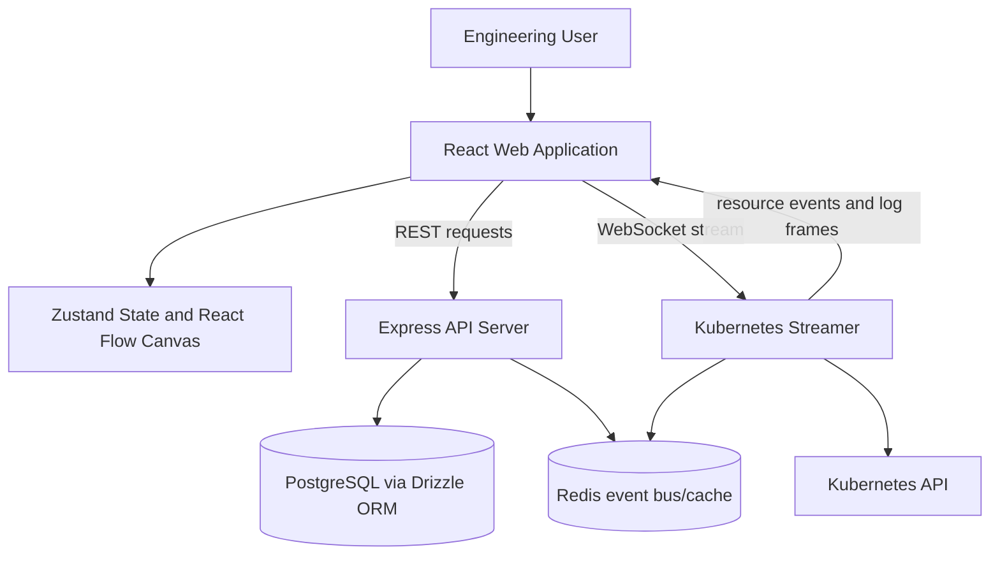
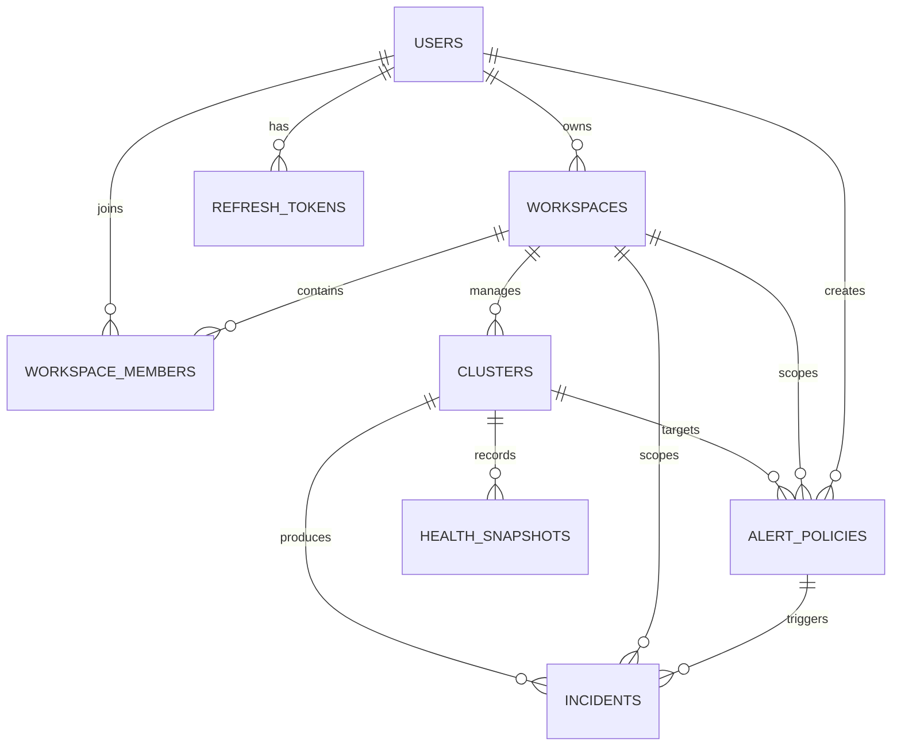

# EnvScale
## Semester 5 Engineering Project Final Report

**Document status:** Draft for academic review
**Project date:** 2026-08-25
**Repository baseline:** `feature/ishika-ish-07`, based on `develop` commit `a477062`

> This report describes the repository evidence available on the ISH-07 branch. Status labels are used throughout: **Implemented** means source evidence exists in this branch; **Partially Implemented** means a user interface or architectural building block exists but service-backed or end-to-end behavior is incomplete; **Planned** means the roadmap describes the work but current-branch evidence does not establish completion; **Design Target** means an intended quality or architecture goal.

## Project Information

| Field | Entry |
|---|---|
| Submitted By | [Student Name] |
| Team Members | [Team Member Names] |
| Roll Numbers | [Roll Number(s)] |
| Department | [Department Name] |
| Institution | [Institution Name] |
| Academic Session | [Academic Session] |
| Project Guide | [Project Guide Name] |
| Submission Date | [Submission Date] |

## Certificate

This is to certify that the project entitled **“EnvScale”**, submitted by **[Student Name(s)]**, bearing roll number(s) **[Roll Number(s)]**, to the **[Department Name]**, **[Institution Name]**, in partial fulfillment of the requirements for the **Semester 5 Engineering Project** during the academic session **[Academic Session]**, is a record of work carried out under my supervision and guidance.

To the best of my knowledge, the work presented in this report has not been submitted elsewhere for the award of any other qualification.

| | |
|---|---|
| Project Guide | Head of Department |
| **[Project Guide Name]** | **[HOD Name]** |
| Date: [Date] | Date: [Date] |

## Declaration

We, **[Student Name(s)]**, declare that the project report entitled **“EnvScale”** is our original work completed under the guidance of **[Project Guide Name]** at **[Institution Name]**. The report is based on the implementation and documentation present in the project repository. All external references used in preparing this report are acknowledged in the References section.

We further declare that this report has not been submitted, in whole or in part, for any other academic award.

| Student signature | Name and roll number |
|---|---|
| ____________________ | [Student Name], [Roll Number] |
| ____________________ | [Student Name], [Roll Number] |
| ____________________ | [Student Name], [Roll Number] |
| ____________________ | [Student Name], [Roll Number] |

## Acknowledgement

We express our sincere gratitude to **[Project Guide Name]**, **[Head of Department Name]**, and the faculty of **[Department Name]** at **[Institution Name]** for their guidance and support throughout this project. We thank our peers, reviewers, and all contributors who provided feedback on the platform’s user experience, architecture, documentation, and quality assurance process.

We also acknowledge the maintainers of React, Vite, TypeScript, Tailwind CSS, React Flow, Zustand, Express, Drizzle ORM, PostgreSQL, Kubernetes, and the related open-source tools used by the project.

# Abstract

Kubernetes enables teams to deploy distributed applications, but operating those applications requires understanding many resources, relationships, status conditions, and telemetry signals at once. Traditional terminal-centric workflows can make this information difficult to correlate, particularly when a team is diagnosing a failing pod or trying to understand how services and workloads are connected.

EnvScale is a Kubernetes-inspired observability and governance platform intended to provide a visual operational workspace. Its web application includes a guided Connect Cluster workflow, an interactive React Flow topology canvas, custom representations for Kubernetes nodes, pods, services, workloads, and ingresses, an inspector drawer, incident and alert-policy views, metrics and leaderboard views, workspace settings, reusable UI primitives, empty states, and a global rendering-error boundary. The API and streamer portions of the repository provide the architectural basis for cluster registration, persistence, validation, Kubernetes event handling, WebSocket communication, and workspace-scoped operational data.

The current repository demonstrates meaningful frontend and schema-level progress. Some capabilities remain partial or planned: live Kubernetes hydration depends on the streamer and target cluster, durable service-backed workflows depend on the API and database, and production deployment, performance benchmarking, chaos testing, and complete security verification are not established as completed results in this branch. This report therefore records both implemented engineering work and the limitations that must be addressed before production or end-to-end completion claims can be made.

# 1. Introduction

Cloud-native systems commonly consist of many services distributed across containers, nodes, and namespaces. Kubernetes provides a powerful control plane for scheduling and managing these workloads, but its flexibility also creates a large operational surface. Engineers may need to correlate pod status, restart counts, node capacity, service selectors, ingress rules, logs, metrics, and alert conditions during a single investigation.

A terminal remains an important Kubernetes interface, but commands often expose one resource category at a time. Understanding a relationship such as ingress to service to pod to node can require several commands and manual mental correlation. This creates a motivation for a visual observability interface that presents related infrastructure state in one workspace while retaining links to detailed diagnostics.

EnvScale addresses this motivation through an application shell organized around topology, incidents and alerts, metrics, leaderboards, and workspace settings. The repository’s design documentation describes a dark enterprise interface with a React Flow canvas, compact navigation, contextual resource inspection, and explicit operational status indicators.

# 2. Problem Statement

Engineering teams operating Kubernetes environments face the following problem:

1. Cluster information is distributed across resource types, namespaces, commands, logs, and monitoring systems.
2. Relationships between nodes, pods, services, workloads, and ingress resources are difficult to understand from isolated command output.
3. Failures such as non-running pods, restarts, or resource pressure require rapid incident awareness and context.
4. Alert configuration and incident history are often separated from the topology where the underlying resource exists.
5. Teams need workspace boundaries and role-aware governance when more than one environment or engineering group is involved.

The project therefore investigates a unified visual platform that can represent Kubernetes state, provide contextual inspection, and support alert and governance workflows without claiming that every production integration is already complete.

# 3. Project Objectives

## 3.1 Primary Objectives

- Develop a visual web workspace for understanding Kubernetes resource topology.
- Reduce the effort required to navigate between cluster resources and operational signals.
- Provide a foundation for workspace-scoped cluster management, alerting, incident records, and health information.
- Establish a modular architecture separating frontend presentation, API/persistence, and Kubernetes event streaming.
- Document implementation status and validate user-visible behavior without overstating incomplete integrations.

## 3.2 Functional Objectives

- Provide a guided cluster-name and kubeconfig upload workflow.
- Render interactive Nodes, Pods, Services, workloads, and ingress relationships.
- Allow users to select resources and inspect available overview, logs, usage, and action panels.
- Present incident records or derived incident information with severity, status, and cluster filters.
- Provide alert-rule configuration controls for CPU, memory, and pod crash/restart conditions.
- Present metrics, cluster health, and leaderboard views.
- Support reusable buttons, badges, cards, modal behavior, toast primitives, empty states, and error recovery.
- Define data structures for users, workspaces, memberships, clusters, alert policies, incidents, and health snapshots.

## 3.3 Quality Objectives

- Keep frontend and shared contracts TypeScript based.
- Provide explicit empty and error states instead of blank screens.
- Maintain clear ownership boundaries between the web, API, and streamer modules.
- Make requirements and implementation status traceable through documentation and QA.
- Design for responsive layouts, accessible controls, maintainable components, and future service integration.

# 4. Existing System and Limitations

Terminal-centric Kubernetes management is precise and scriptable, but it requires operators to remember commands, flags, namespaces, and resource relationships. It is also difficult to keep several views of a distributed system mentally synchronized during an incident.

A collection of disconnected monitoring views can expose useful signals while still requiring manual correlation. A metrics view may identify pressure, an event view may identify a failing pod, and a service view may identify routing, but the relationship among those facts is not always apparent. Teams also need consistent alert and incident terminology, role boundaries, and a way to preserve operational context.

These limitations motivate EnvScale’s visual approach. They do not imply that all existing monitoring tools lack these capabilities, nor do they establish quantitative improvements. The repository contains no production user study, measured MTTR reduction, availability result, or comparative benchmark.

# 5. Proposed System: EnvScale

EnvScale is proposed as a visual Kubernetes observability and governance platform. The current web application provides a substantial interface foundation:

- **Implemented:** Application shell, top navbar, cluster selector, sidebar navigation, topology view, incidents and alert-policy view, metrics view, leaderboard view, and workspace settings view.
- **Implemented:** Connect Cluster wizard with required-name validation, YAML extension validation, file selection, step navigation, and connection result states.
- **Implemented:** React Flow canvas integration, custom resource node registrations, layout controls, selection handling, and an empty topology message.
- **Implemented:** Incident derivation from available pod and notification state, severity/status/cluster filtering, summary cards, severity badges, and empty incident presentation.
- **Implemented:** Alert-rule builder and list UI with metric, operator, threshold, duration, severity, namespace, and enabled-state controls.
- **Implemented:** Reusable UI primitives and the ISH-04 EmptyState/ErrorBoundary work when those artifacts are present in an integrated branch.
- **Partially Implemented:** Live resource synchronization, pod log streaming, cluster persistence, alert evaluation, health calculation, authentication, RBAC enforcement, and durable incident lifecycle behavior because these require service integration and end-to-end verification.
- **Planned or Design Target:** Multi-instance event distribution, production cloud deployment, measured performance, complete security hardening, chaos validation, and cross-browser QA.

# 6. Project Scope

| Feature | Status | Description |
|---|---|---|
| Connect Cluster onboarding | Implemented | Three-step web wizard for cluster name, kubeconfig selection, and connection result. |
| Kubeconfig upload UI | Implemented | File input/dropzone accepts YAML extensions and rejects other filenames. |
| Cluster topology visualization | Implemented / Partially Implemented | React Flow canvas and layout controls exist; live hydration depends on the streamer. |
| Kubernetes Nodes | Implemented | Custom node rendering and shared node data types exist. |
| Kubernetes Pods | Implemented | Custom pod rendering and pod status/resource data are present. |
| Kubernetes Services | Implemented | Custom service rendering and selector/routing data are present. |
| Incident History | Partially Implemented | Client-side incident derivation and view exist; durable lifecycle depends on backend integration. |
| Severity badges | Implemented | Incident and leaderboard views render severity/status indicators. |
| Status filters | Implemented | Incident view supports status filtering. |
| Alert configuration | Implemented / Partially Implemented | Builder/list UI exists; durable evaluation and persistence require service integration. |
| Empty states | Implemented in ISH-04 work | Explicit topology, incident, and alert-rule no-data states are part of the frontend work. |
| Global Error Boundary | Implemented in ISH-04 work | Root-level render-error fallback is part of the frontend work. |
| Cluster Health Index | Partially Implemented | Health score concepts and schema fields exist; continuous production computation is not established. |
| Leaderboard | Implemented UI / Partially Implemented data | Cluster and member leaderboard screens exist; current values include client-derived or demo presentation. |
| Authentication | Partially Implemented | API authentication modules and routes exist; end-to-end enforcement and deployment verification are incomplete. |
| RBAC | Partially Implemented | Roles and membership schema/middleware building blocks exist; complete route coverage requires verification. |
| Kubernetes streaming | Partially Implemented | Streamer architecture and frontend hook direction exist; live cluster operation is environment-dependent. |
| WebSocket communication | Partially Implemented | WebSocket endpoint and frontend connection path are documented; production contract and reliability evidence are incomplete. |
| Pod log streaming | Partially Implemented | Frontend log drawer/request paths exist; live streamer delivery is not established here. |
| Chaos testing | Planned / Partially Implemented | Chaos package and UI action direction exist; complete controlled validation is planned. |
| AWS deployment | Planned | AWS EKS is a roadmap target; no completed deployment evidence is present. |

# 7. Technology Stack

## 7.1 Frontend

| Technology | Repository evidence and use |
|---|---|
| React | `apps/web` components and application shell. |
| TypeScript | Web source, shared types, and package build scripts. |
| Vite | Web development and production build scripts. |
| Tailwind CSS | Utility classes and Tailwind configuration in the web app. |
| React Flow | `@xyflow/react` canvas provider, nodes, edges, controls, and background. |
| Zustand | Topology, cluster, notification, and alert-rule state stores. |
| React Icons | Material icon imports used across the web application. |
| Dagre | Layout utility used for graph positioning. |

## 7.2 Backend

| Technology | Repository evidence and use |
|---|---|
| Node.js | Runtime target for the API server package. |
| Express | Typed route/controller server framework dependency. |
| PostgreSQL | Database target used by the Drizzle client and schema. |
| Drizzle ORM | PostgreSQL schema and relational data access layer. |
| Zod | Request schema and validation middleware dependency. |
| Redis | Repository architecture and streamer package direction for event distribution/cache. |

## 7.3 Kubernetes and Streaming

| Technology | Repository evidence and use |
|---|---|
| Kubernetes APIs | Cluster/resource integration target. |
| client-go | Streamer architecture and dependency direction for Kubernetes integration. |
| Informers | Event-driven Kubernetes observation design described by the streamer documentation. |
| WebSocket | Streamer endpoint and frontend `useK8sStream` communication path. |
| Gorilla WebSocket | Streamer architecture documentation identifies a concurrent WebSocket gateway. |

## 7.4 Development Tooling

| Technology | Repository evidence and use |
|---|---|
| pnpm | Workspace package manager and scripts. |
| Turborepo | Root build orchestration. |
| TypeScript compiler | Package build and type-check commands. |
| ESLint | Web lint script and configuration. |
| Docker Compose | Local PostgreSQL/Redis development configuration is documented in the repository. |
| Go tooling | Streamer `go.mod` and Go service structure. |

# 8. System Architecture

## 8.1 Architecture Description

The repository separates the user interface from service and infrastructure responsibilities. The React web application owns presentation, local interaction, topology state, and user workflows. The API server owns typed REST routes, request validation, persistence-facing services, and workspace-oriented data. The streamer owns Kubernetes observation and event delivery through the documented WebSocket gateway direction. PostgreSQL stores durable entities, while Redis is intended to support shared event distribution and cache behavior.

The current web application can render its shell and several views without the external services. Live topology state, cluster persistence, log streaming, and service-backed alert or incident workflows require those dependencies to be available. This distinction is important: a rendered screen is not evidence that a target cluster has been connected or that live telemetry is flowing.

## 8.2 Architecture Diagram



**Implemented architecture:** Web application composition, React Flow provider, Zustand stores, API module structure, database schema, and streamer package structure are present.
**Partially implemented architecture:** End-to-end event delivery, authenticated service calls, durable persistence, and live Kubernetes operation require coordinated runtime verification.
**Planned architecture:** Production deployment, scaling, operational telemetry, and cloud infrastructure are roadmap work.

# 9. Module Description

## 9.1 Frontend Module

The web application’s `App` component composes the top navbar, left navigation sidebar, topology canvas, inspector drawer, pod log drawer, onboarding wizard, and kubectl terminal. The active view is selected through local application state.

The topology module uses React Flow and registers custom renderers for pods, worker nodes, services, workloads, and ingresses. It connects to the topology store and the `useK8sStream` hook, applies Dagre layout, supports resource selection, and displays an empty topology state.

The incidents module derives records from pod anomalies and notifications available in the client store. It provides severity, status, and cluster filters, status/severity badges, summary values, and a separate alert-rule subview. The current implementation is a frontend workflow and does not by itself prove persistent incident history.

The metrics and leaderboard views are present as user-facing screens. Their current implementation contains UI and client-side/demo values; live metric and durable ranking integration remains partial. Settings presents encrypted-vault, RBAC, and API-token areas.

The frontend also contains shared Button, Modal, Badge, Card, and Toast primitives, plus onboarding, drawer, terminal, layout, and error/empty-state components.

## 9.2 API Server Module

The API package contains Express application code organized into controllers, routes, middleware, schemas, services, workers, configuration, and database modules. Repository evidence includes authentication, workspace, cluster, alert, incident, and leaderboard controller families; Zod request schemas; authentication middleware; and a Drizzle PostgreSQL client/schema direction.

The API module is therefore a substantial backend foundation. This report does not claim that every route is production-ready, fully authenticated, connected to a live database, or end-to-end tested. Those claims require runtime, integration, security, and deployment evidence.

## 9.3 Kubernetes Streamer Module

The streamer package is a Go service organized around Kubernetes, WebSocket, Redis, crypto, and chaos areas. Its README describes a high-performance gateway using Kubernetes client-go informers and a concurrent WebSocket hub, with documented local health and stream endpoints.

The streamer’s intended responsibility is to observe Kubernetes resources and broadcast normalized state changes. Live informer correctness, reconnect behavior under failure, log delivery, Redis fan-out, and production load characteristics require execution against a configured Kubernetes environment and are not claimed as complete in this report.

## 9.4 Data Management Module

The API schema provides relational entities for users, refresh tokens, workspaces, workspace members, clusters, alert policies, incidents, and health snapshots. Foreign keys and indexes express relationships and common lookup paths. The current schema names the health table `health_snapshots` and the cluster credential field `kubeconfig`; this report does not rename those concepts to roadmap-only alternatives.

The data design supports workspace-scoped ownership of clusters, policies, and incidents. The repository also includes shared TypeScript representations for users, workspaces, clusters, roles, WebSocket events, pods, nodes, services, and log payloads.

## 9.5 Quality Assurance and Documentation Module

The repository contains roadmap and design documentation describing QA, SRS, report, presentation, and video responsibilities. On this ISH-07 branch, the prior ISH-05 QA matrix, bug tracker, and ISH-06 SRS are not present because the branch was created from `develop`; they were not recovered from other branches. This report therefore records source and roadmap evidence rather than citing unavailable execution artifacts.

The ISH-07 deliverable itself is this final report. A future integrated branch may add the QA matrix and SRS as traceability inputs, but their absence here is an explicit repository limitation.

# 10. System Design

## 10.1 Use Case Overview

| Actor | Use case | Current status |
|---|---|---|
| Engineering user | Open the web workspace and navigate views | Implemented frontend behavior |
| Engineering user | Select a cluster or open Connect Cluster | Implemented frontend behavior |
| Engineering user | Enter a cluster name and choose a kubeconfig | Implemented frontend validation/UI |
| Engineering user | Inspect topology relationships | Implemented canvas behavior; live data partial |
| Engineering user | Inspect a selected resource | Implemented frontend drawer; service actions partial |
| Engineering user | Filter incidents and review severity/status | Implemented frontend behavior |
| Engineering user | Create an alert rule | Implemented builder UI; persistence/evaluation partial |
| Engineering user | Review metrics and health information | Implemented UI; live data partial |
| Engineering user | Review leaderboard rankings | Implemented UI; durable ranking partial |
| Workspace administrator | Manage workspace members and permissions | Planned/partial service workflow |
| Streamer service | Observe Kubernetes resources and emit events | Architectural direction; end-to-end completion unverified |

## 10.2 Component Design

Major components include:

- **Application shell:** `App`, `TopNavbar`, and `LeftSidebar`.
- **Topology:** `TopologyCanvas`, custom canvas nodes, layout utility, and topology store.
- **Inspection:** `InspectorDrawer`, `PodLogDrawer`, and `KubectlTerminal`.
- **Onboarding:** `ConnectClusterWizard` and API client configuration.
- **Operations:** `IncidentsView`, alert rule builder/list/modal, `MetricsView`, `LeaderboardView`, and `SettingsView`.
- **Resilience:** reusable UI primitives, explicit empty states, and global ErrorBoundary work.
- **Services:** API controllers/routes/schema/services and the Go streamer packages.

## 10.3 Data Flow

1. A user opens the web application and chooses a cluster or opens onboarding.
2. The onboarding workflow validates the name and kubeconfig file selection.
3. The frontend API client can submit cluster registration to configured service endpoints.
4. The streamer is intended to observe Kubernetes resources and emit events.
5. The frontend WebSocket hook receives and normalizes messages for the topology store.
6. React Flow renders resource nodes and relationships, while the inspector exposes selected-resource context.
7. Pod anomalies and notifications can contribute to the current client-side incident view.
8. Alert policies, incidents, health snapshots, and workspace records are intended to be persisted through the API and PostgreSQL.

Steps 3–8 are partially dependent on external services. The current branch contains code and architecture for the path but no end-to-end runtime evidence sufficient to claim the full flow is operational.

# 11. Database Design

## 11.1 Entities and Relationships

The current Drizzle schema contains the following entities:

- **Users:** profile, authentication-related, role, active-state, login, and timestamp fields.
- **Refresh tokens:** user-linked token hashes, expiry, revocation, and timestamps.
- **Workspaces:** name, slug, description, owner, metadata, active-state, and timestamps.
- **Workspace members:** compound workspace/user membership with role and timestamps.
- **Clusters:** workspace association, name, type, optional kubeconfig, endpoint/version, node count, health score, status, metadata, and synchronization timestamps.
- **Alert policies:** workspace/cluster association, name, description, metric, threshold, operator, duration, severity, enabled-state, conditions, notification channels, creator, and timestamps.
- **Incidents:** workspace/cluster/policy association, title, description, severity, status, value, acknowledgement, resolution, root-cause, related events, and timestamps.
- **Health snapshots:** cluster association, health score, timestamp, structured details, pod/node/network/storage status, uptime, and creation timestamp.

## 11.2 Entity Relationship Diagram



The diagram represents repository-declared relationships at a conceptual level. It intentionally omits field-level claims that are not needed for the report and does not introduce a separate `Kubeconfigs` entity because the current schema represents kubeconfig material as a field on `clusters`.

# 12. User Interface and Experience

The design documentation specifies a dark enterprise interface with a matte canvas, restrained neutral borders, blue primary actions, status colors, floating navbar/sidebar capsules, and compact operational panels. The web source reflects this direction through Tailwind classes, the `#09090b` canvas background, neutral surfaces, status colors, and Geist font import.

The topology workspace is the primary visual surface. It combines a dotted React Flow background, custom nodes, graph actions, selection behavior, and an empty state when no nodes exist. The onboarding wizard uses a three-step progression and inline validation. The incidents screen combines summary cards, filters, badges, an audit-log presentation, and an alert-rule subview.

The ISH-04 work adds explicit reusable EmptyState and global ErrorBoundary concepts. The EmptyState is intended to make no-data and no-filter-match conditions understandable. The ErrorBoundary is intended to prevent a rendering failure from becoming a blank application screen and to provide a recovery action without exposing a normal-user stack trace.

Responsive classes occur throughout the web interface, but complete cross-browser, keyboard, contrast, touch-target, and mobile overflow verification remains a QA responsibility rather than a claim of this report.

# 13. Implementation Summary

| Milestone | Major work | Status |
|---|---|---|
| Milestone 1 | Monorepo setup, web foundation, PostgreSQL/Drizzle direction, shared types, initial UI and development configuration | Partially Implemented: repository foundations and several setup artifacts exist; full infrastructure acceptance is not established. |
| Milestone 2 | Kubernetes streamer direction, API modules, onboarding, authentication/RBAC building blocks, WebSocket hook, log drawer | Partially Implemented: source modules and frontend workflows exist; service-backed end-to-end behavior remains incomplete or unverified. |
| Milestone 3 | React Flow topology, Dagre layout, custom resource nodes, alerts, incidents, health and leaderboard views | Partially Implemented: frontend surfaces and schema/API foundations exist; live evaluation, persistence, and ranking integration are not fully established. |
| Milestone 4 | Cloud deployment, chaos testing, load testing, security hardening, QA, final report and defense materials | Planned / In Progress: roadmap and documentation responsibilities exist, but no evidence in this branch proves complete cloud, chaos, benchmark, or defense delivery. |

# 14. Testing and Quality Assurance

## 14.1 Available Validation

The repository provides package scripts for web build and lint, API build/type-check, and root Turborepo build orchestration. The final integrated QA process should include:

- TypeScript compilation and package builds.
- ESLint validation.
- Browser black-box checks for onboarding, navigation, topology empty state, incidents, alert rules, settings, and responsive behavior.
- API contract and validation tests.
- Database migration and relationship checks.
- Streamer health, WebSocket, informer, reconnection, and log-stream tests.
- Security tests for authentication, RBAC, kubeconfig protection, validation, and error handling.

## 14.2 Current-Branch Evidence Limitation

The ISH-05 QA matrix and bug tracker and the ISH-06 SRS are not available on this branch. They are not treated as completed inputs or copied from another branch. The present report is based on the source and documentation available at the `develop`-based ISH-07 baseline.

## 14.3 Test Claims

No production users, production uptime, AWS deployment, measured performance benchmark, completed chaos run, or end-to-end Kubernetes integration result is claimed in this report. Such results require dated execution records, reproducible environments, and retained test output.

# 15. Results and Observations

The repository demonstrates the following engineering results:

- A coherent React application shell connects navigation, topology, operational views, drawers, onboarding, and terminal surfaces.
- The topology implementation has a real React Flow integration, custom resource node registrations, Dagre layout support, selection behavior, and an explicit no-data presentation.
- The onboarding UI validates required cluster names and kubeconfig filename extensions before progressing.
- The incidents UI derives client-visible incident information and provides severity, status, and cluster filtering.
- The alert UI provides configuration controls and an empty-state presentation for unconfigured rules.
- The API schema establishes relationships for workspace-scoped clusters, policies, incidents, users, members, and health snapshots.
- The streamer module documents an event-driven Kubernetes/WebSocket direction.
- The repository contains roadmap and design documentation that identifies ownership, intended architecture, and remaining work.

These observations establish implementation progress, not a claim that all components are connected in a deployed production environment.

# 16. Current Limitations

1. The web application’s live topology and telemetry depend on the streamer and a reachable Kubernetes target.
2. API-backed registration, authentication, persistence, policy evaluation, incident lifecycle, and workspace management require service and database runtime verification.
3. Current metrics and leaderboard screens include client-side or demo presentation values and should not be treated as authoritative live telemetry without integration evidence.
4. The branch does not contain the ISH-05 QA matrix/bug tracker or ISH-06 SRS, because it was created from `develop`; those documents were intentionally not recovered from other branches.
5. No evidence in this branch establishes completed AWS EKS deployment, production availability, performance targets, or chaos-testing outcomes.
6. Complete keyboard, cross-browser, contrast, mobile, and assistive-technology verification remains outstanding.
7. Security controls require route-by-route and deployment-level verification, especially for authentication, RBAC, kubeconfig handling, secrets, CORS, rate limiting, and auditability.
8. The project roadmap and source can describe intended event transports differently in places; deployed communication contracts must be made authoritative and tested before release.

# 17. Future Enhancements

The following work is future work or requires completion and verification:

- Complete live Kubernetes informer-to-frontend event hydration for Pods, Nodes, Services, workloads, and ingress resources.
- Complete authenticated, workspace-scoped REST workflows and durable PostgreSQL persistence.
- Replace demo metrics and ranking values with current, timestamped service-backed telemetry.
- Complete live pod stdout/stderr streaming and robust log-drawer integration.
- Implement durable alert evaluation, notifications, incident acknowledgement, resolution, and audit history.
- Verify and harden end-to-end RBAC, kubeconfig encryption/storage, secret handling, validation, CORS, rate limiting, and audit logs.
- Add repeatable performance, load, reconnection, large-topology, and resource-usage benchmarks.
- Execute controlled chaos scenarios for pod failure, resource pressure, node availability, and network/service disruption.
- Define and validate deployment artifacts for Minikube/K3s and AWS EKS.
- Complete cross-browser, keyboard, contrast, mobile, and accessibility audits.
- Produce the integrated QA matrix, SRS, presentation, video demonstration, operator guide, deployment runbook, and troubleshooting documentation in the release branch.
- Establish data retention, backup, recovery, key rotation, incident response, and tenant export procedures.

# 18. Conclusion

EnvScale addresses a concrete engineering problem: Kubernetes operations expose a large set of distributed resources and signals that are difficult to correlate through isolated terminal commands or disconnected views. The repository implements a meaningful visual foundation for that problem through a React Flow topology workspace, custom resource visualization, guided cluster onboarding, contextual inspection, incident and alert-policy interfaces, metrics and leaderboard screens, workspace settings, and resilience-oriented UI components.

The API schema and module organization provide a corresponding foundation for workspace-scoped persistence, policies, incidents, health snapshots, authentication, and authorization. The Go streamer documentation and package layout establish an event-driven Kubernetes integration direction. Together, these modules demonstrate a modular engineering approach appropriate for a Semester 5 project.

At the same time, the current repository evidence requires a disciplined conclusion. The platform is not represented as a completed production deployment. Live service integration, security enforcement, cloud deployment, performance measurement, chaos validation, and complete QA remain partial or planned. Future work should prioritize reproducible end-to-end environments and traceable test evidence so that the visual experience is supported by reliable operational behavior.

# 19. References

1. [EnvScale README](../README.md)
2. [EnvScale Feature Matrix](features.md)
3. [EnvScale Milestones and Technical Roadmap](milestones.md)
4. [EnvScale UI and UX Design System](design.md)
5. [EnvScale Project Idea and Scope](idea.md)
6. [EnvScale PRD Research](EnvScale%20PRD%20Research.md)
7. [Web application README](../apps/web/README.md)
8. [API server package manifest](../apps/api-server/package.json)
9. [Kubernetes streamer README](../apps/k8s-streamer/README.md)
10. [Shared type definitions](../packages/types/src/index.ts)
11. [Database schema](../apps/api-server/src/db/schema.ts)
12. [React documentation](https://react.dev/)
13. [React Flow documentation](https://reactflow.dev/)
14. [Kubernetes documentation](https://kubernetes.io/docs/)
15. [TypeScript documentation](https://www.typescriptlang.org/docs/)
16. [PostgreSQL documentation](https://www.postgresql.org/docs/)

# 20. Appendices

## Appendix A — Glossary

| Term | Definition |
|---|---|
| Cluster | A Kubernetes environment observed or managed through EnvScale. |
| Topology | A graph representation of resources and their relationships. |
| Pod | A Kubernetes execution unit represented in the topology. |
| Node | A Kubernetes worker or control-plane host represented in the topology. |
| Service | A Kubernetes abstraction used to route traffic to workloads. |
| Incident | An operational anomaly represented by client state or a persisted service record. |
| Empty state | A user-facing explanation shown when a view has no available or matching data. |
| Workspace | A tenant boundary for members, clusters, policies, incidents, and related data. |
| Kubeconfig | Kubernetes client configuration containing connection and credential material. |
| Stream delta | An event describing a resource or telemetry change. |

## Appendix B — Acronyms

| Acronym | Meaning |
|---|---|
| API | Application Programming Interface |
| AWS | Amazon Web Services |
| EKS | Elastic Kubernetes Service |
| FR | Functional Requirement |
| JWT | JSON Web Token |
| ORM | Object-Relational Mapping |
| QA | Quality Assurance |
| RBAC | Role-Based Access Control |
| REST | Representational State Transfer |
| SRS | Software Requirements Specification |
| SSE | Server-Sent Events |
| UI | User Interface |
| UX | User Experience |
| WebSocket | Persistent bidirectional web communication protocol |

## Appendix C — Requirement Traceability Summary

The report’s scope follows the repository feature matrix and milestone roadmap. Traceability is organized by responsibility:

| Area | Primary repository evidence |
|---|---|
| Onboarding and UI resilience | `apps/web/src/components/onboarding`, `apps/web/src/components/ui`, `apps/web/src/components/ErrorBoundary.tsx` when integrated |
| Topology and resource visualization | `apps/web/src/components/flow`, `apps/web/src/components/canvas`, `apps/web/src/store`, `apps/web/src/utils/layout.ts` |
| Incidents and alerts | `apps/web/src/components/views/IncidentsView.tsx`, `apps/web/src/components/alerts`, `apps/web/src/store` |
| API and persistence | `apps/api-server/src/routes`, `controllers`, `middleware`, `schemas`, `services`, `db/schema.ts` |
| Streaming | `apps/k8s-streamer/pkg`, `cmd/server`, `README.md`, `apps/web/src/hooks/useK8sStream.ts` |
| Shared contracts | `packages/types/src/index.ts` |
| Roadmap and design | `docs/features.md`, `docs/milestones.md`, `docs/design.md`, `docs/idea.md` |
| QA/reporting | Roadmap documentation on this branch; ISH-05 and ISH-06 artifacts unavailable on this branch |

## Appendix D — QA Summary

The current branch does not contain the prior ISH-05 execution matrix or bug tracker, so this report does not invent pass/fail counts or browser results. The required release QA should record test ID, feature, preconditions, steps, expected result, actual result, status, environment, and notes. It should separately record build/type/lint outcomes and distinguish product defects from unavailable API, database, streamer, or Kubernetes dependencies.

## Appendix E — Development Workflow

The repository’s intended workflow is:

```text
Feature branch
      |
      v
Implementation and local validation
      |
      v
Commit
      |
      v
Push feature branch
      |
      v
Pull request targeting develop
      |
      v
Review and CI
      |
      v
Merge after approval
```

ISH-07 is documentation-only. The expected change for this task is `docs/EnvScale-Final-Project-Report.md`; no source code, dependency manifest, previous-task implementation, or other branch should be modified.
