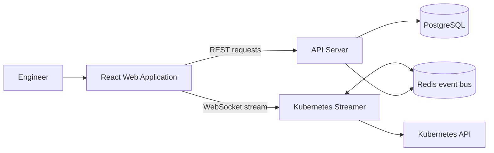

# EnvScale Software Requirements Specification

**Version:** 1.0
**Date:** 2026-08-24
**Status:** Draft for engineering and academic review
**Repository:** EnvScale
**Primary documentation owner:** Ishika

> This document uses repository evidence available on 2026-08-24. `[Implemented]` means a corresponding implementation is present in the repository; it does not imply that every external service or end-to-end workflow has been verified. `[Planned]` identifies work described by the roadmap but not established as complete by the current implementation. `[Design Target]` identifies an architectural or quality goal that requires further verification or implementation.

## Table of Contents

1. [Introduction](#1-introduction)
   1. [Purpose](#11-purpose)
   2. [Document Conventions](#12-document-conventions)
   3. [Intended Audience and Reading Suggestions](#13-intended-audience-and-reading-suggestions)
   4. [Product Scope](#14-product-scope)
   5. [References](#15-references)
2. [Overall Description](#2-overall-description)
   1. [Product Perspective](#21-product-perspective)
   2. [Product Functions](#22-product-functions)
   3. [User Classes and Characteristics](#23-user-classes-and-characteristics)
   4. [Operating Environment](#24-operating-environment)
   5. [Design and Implementation Constraints](#25-design-and-implementation-constraints)
   6. [User Documentation](#26-user-documentation)
   7. [Assumptions and Dependencies](#27-assumptions-and-dependencies)
3. [External Interface Requirements](#3-external-interface-requirements)
4. [System Features](#4-system-features)
5. [Nonfunctional Requirements](#5-nonfunctional-requirements)
6. [Data Requirements](#6-data-requirements)
7. [System Architecture Overview](#7-system-architecture-overview)
8. [Security Requirements](#8-security-requirements)
9. [Quality Assurance and Testing](#9-quality-assurance-and-testing)
10. [Future Enhancements](#10-future-enhancements)
11. [Appendices](#11-appendices)

## 1. Introduction

### 1.1 Purpose

This Software Requirements Specification defines the functional, nonfunctional, data, interface, security, and quality requirements for EnvScale. It provides a traceable baseline for implementation, review, QA, and academic project documentation.

The specification covers the current React web application, its intended REST API and persistence layer, and the Kubernetes streaming gateway. It deliberately separates code that exists today from roadmap commitments and design intentions.

### 1.2 Document Conventions

- Requirement identifiers are unique and stable. `FR` denotes a functional requirement, `NFR` a nonfunctional requirement, and `SEC` a security requirement.
- Each formal requirement uses “shall” and is written to be testable.
- Priority values are defined in [Appendix C](#c-requirement-priority-definitions).
- A requirement status is shown in its heading: `[Implemented]`, `[Planned]`, or `[Design Target]`.
- “Web application” refers to `apps/web`; “API server” refers to `apps/api-server`; “streamer” refers to `apps/k8s-streamer`.

### 1.3 Intended Audience and Reading Suggestions

- **Product and academic reviewers:** Read Sections 1, 2, 4, and 10 for scope and delivery status.
- **Frontend engineers:** Read Sections 3, 4.1–4.13, and 5.
- **Backend and streaming engineers:** Read Sections 3.3–3.4, 6, 7, and 8.
- **QA engineers:** Read Sections 4, 5, and 9 together with the ISH-05 execution matrix.
- **Operators and future users:** Read Sections 2.3, 3.1, and 4 for the intended user workflows.

### 1.4 Product Scope

EnvScale is intended to give engineering teams a visual control surface for Kubernetes environments. The product scope includes:

- Connecting named Kubernetes clusters through a guided web workflow.
- Rendering Nodes, Pods, Services, workloads, and relationships on an interactive topology canvas.
- Inspecting selected resources, metrics, and pod logs.
- Viewing incident and alert-policy information.
- Creating and managing custom alert rules through the web UI.
- Viewing cluster health and leaderboard information.
- Supporting workspaces, members, and role-based access controls through the platform architecture.
- Providing resilient empty states and a global rendering-error fallback.

The current repository demonstrates substantial frontend functionality, while service-backed authentication, persistence, live cluster hydration, and production-grade operational guarantees are not uniformly complete.

### 1.5 References

1. [EnvScale README](../README.md)
2. [Feature Matrix and Task Directory](features.md)
3. [Production Implementation Milestones](milestones.md)
4. [UI and UX Design System](design.md)
5. [EnvScale PRD Research](EnvScale%20PRD%20Research.md)
6. [ISH-05 QA Test Execution Matrix](qa/ISH-05-QA-Test-Matrix.md)
7. [ISH-05 Bug Tracker](qa/ISH-05-Bug-Tracker.md)
8. [Shared Type Definitions](../packages/types/src/index.ts)
9. [API Database Schema](../apps/api-server/src/db/schema.ts)
10. [Kubernetes Streamer README](../apps/k8s-streamer/README.md)
11. [React Flow documentation](https://reactflow.dev/)
12. [Kubernetes documentation](https://kubernetes.io/docs/)

## 2. Overall Description

### 2.1 Product Perspective

EnvScale is a monorepo platform with four principal layers:

1. **Web frontend:** React, TypeScript, Vite, Tailwind CSS, React Flow, Zustand, and icon libraries. The current shell is assembled in `apps/web/src/App.tsx` and `apps/web/src/main.tsx`.
2. **API server:** Express and TypeScript services with Drizzle ORM, PostgreSQL, request validation, and workspace-oriented controllers and routes.
3. **Kubernetes streamer:** Go service using Kubernetes client-go concepts, informers, a WebSocket gateway, Redis support, and a crypto package. Its documented local port is `8080`.
4. **Persistence and messaging:** PostgreSQL is the schema-backed persistence target; Redis is the intended event-bus/cache component for scaled streaming.

The frontend currently communicates with a WebSocket URL through `useK8sStream`, while cluster registration and other service calls are represented by API client code. The exact production transport split remains an architecture concern and must be kept consistent with the deployed implementation.

### 2.2 Product Functions

The product function set is divided into current web behavior and service-backed goals:

| Function | Current status |
|---|---|
| Web shell and sidebar navigation | `[Implemented]` |
| Cluster selector and onboarding wizard | `[Implemented]` in the web application |
| React Flow topology canvas and empty topology state | `[Implemented]` |
| Resource node rendering and selection | `[Implemented]` in the web application |
| Inspector tabs for overview, logs, usage, and chaos actions | `[Implemented]` in the web application; external execution requires services |
| Metrics screen | `[Implemented]` UI with current static/demo values |
| Incident derivation and filters | `[Implemented]` client-side behavior |
| Alert-rule builder and list UI | `[Implemented]` client-side behavior |
| Leaderboard screen | `[Implemented]` UI with client-derived/demo values |
| Workspace settings screen | `[Implemented]` UI; service persistence is not established end to end |
| Global EmptyState and ErrorBoundary | `[Implemented]` |
| Live Kubernetes event hydration | `[Planned]` / `[Design Target]` end-to-end verification |
| Durable multi-tenant authentication, authorization, and persistence | `[Planned]` / partial backend implementation |

### 2.3 User Classes and Characteristics

- **Platform administrator:** Manages workspaces, members, clusters, policies, and operational controls. Requires strong authorization and auditability.
- **Engineering member:** Views topology, metrics, incidents, and logs and may perform permitted operational actions.
- **Read-only viewer:** Reviews topology, incidents, health, and leaderboard information without configuration privileges.
- **SRE, platform engineer, or DevOps engineer:** Uses resource inspection, telemetry, alerting, and incident workflows during normal operations and troubleshooting.
- **Developer or engineering lead:** Uses visual status, health scores, and governance views to understand application reliability.

The shared type package defines workspace roles `ADMIN`, `MEMBER`, and `VIEWER`. The settings view also presents these roles.

### 2.4 Operating Environment

- **Client:** Modern browser with JavaScript enabled and support for React Flow, WebSocket APIs, file inputs, and responsive layouts.
- **Frontend development:** Node.js with pnpm, Vite, React, TypeScript, and Tailwind CSS.
- **API runtime:** Node.js and Express with PostgreSQL connectivity through Drizzle ORM.
- **Streaming runtime:** Go service using Kubernetes client-go and Gorilla WebSocket-related infrastructure.
- **Data services:** PostgreSQL and Redis as defined by the repository architecture and development compose configuration.
- **Kubernetes targets:** Minikube, K3s, and the proposed AWS EKS deployment target.
- **Development ports documented in code:** API defaults to `3000`; streamer defaults to `8080`; Vite commonly serves the web app on `5173`.

### 2.5 Design and Implementation Constraints

- The frontend shall remain React and TypeScript based and use the existing Vite/Tailwind/React Flow/Zustand stack.
- The API shall remain typed TypeScript/Express and use Drizzle ORM for the PostgreSQL schema.
- Kubernetes integration shall be owned by the streamer and use the repository’s client-go/WebSocket direction.
- Sensitive kubeconfig material shall not be exposed in normal UI output or logs.
- Workspace isolation and role-based access are architectural constraints, not optional UI features.
- Existing UI patterns use a dark EnvScale surface palette, Material iconography in much of the web code, and responsive Tailwind classes.
- The current repository contains roadmap statements that are more expansive than verified implementation; implementation status in this SRS takes precedence over roadmap prose.

### 2.6 User Documentation

The repository currently provides README, design, feature, milestone, Git workflow, PRD research, and ISH-05 QA documentation. User-facing onboarding guidance is embedded in the Connect Cluster wizard. A complete operator guide, API reference, deployment runbook, and role-specific help center are `[Planned]`.

### 2.7 Assumptions and Dependencies

- A reachable Kubernetes cluster and valid kubeconfig are required for live topology and resource workflows.
- API and streamer availability are required for service-backed registration, snapshots, event hydration, and log streaming.
- PostgreSQL and Redis availability are required for durable and horizontally scaled workflows.
- The browser must permit WebSocket connections to the configured streamer URL.
- The current frontend can render with empty or demo state when external services are unavailable; this must not be interpreted as successful live synchronization.
- The project depends on the package versions declared in the workspace manifests and lockfiles.

## 3. External Interface Requirements

### 3.1 User Interfaces

- **UI-FR-001 `[Implemented]`:** The web application shall present a persistent top navigation area containing the EnvScale identity, active cluster selector, connection status, notification control, and user/workspace controls.
- **UI-FR-002 `[Implemented]`:** The web application shall provide sidebar navigation for topology, incidents and alerts, metrics, leaderboard, and settings views.
- **UI-FR-003 `[Implemented]`:** The web application shall present onboarding as a three-step modal workflow with cluster name input, kubeconfig file input/dropzone, and connection confirmation/error states.
- **UI-FR-004 `[Implemented]`:** The web application shall provide accessible labels or titles for relevant interactive controls, including navigation, file input, close controls, and action buttons.
- **UI-FR-005 `[Implemented]`:** The web application shall provide a responsive dark interface using the existing EnvScale visual language.
- **UI-FR-006 `[Implemented]`:** The web application shall render a useful empty state when topology or incident data is absent and a recovery state when a descendant render error is caught.

### 3.2 Hardware Interfaces

No direct hardware interface is required. Kubernetes nodes, storage, and network devices are accessed through Kubernetes APIs and service interfaces. Local hardware requirements are `[Planned]` deployment documentation and are not specified as product contracts in the current repository.

### 3.3 Software Interfaces

- **SW-FR-001 `[Implemented]`:** The web application shall use the React Flow library for interactive topology rendering.
- **SW-FR-002 `[Implemented]`:** The web application shall use Zustand-backed state for topology, cluster, notification, and alert-rule state where provided by the current source.
- **SW-FR-003 `[Implemented]`:** The API server shall expose typed Express route/controller modules and Zod validation middleware for supported request paths.
- **SW-FR-004 `[Implemented]`:** The API data layer shall define PostgreSQL entities through Drizzle ORM schema declarations.
- **SW-FR-005 `[Design Target]`:** The deployed services shall preserve compatible contracts between web clients, API endpoints, streamer event envelopes, PostgreSQL records, and Redis messages.

### 3.4 Communications Interfaces

- **COM-FR-001 `[Implemented]`:** The web application shall be able to construct a WebSocket connection to the configured Kubernetes stream URL and include a cluster identifier in the connection URL.
- **COM-FR-002 `[Implemented]`:** The frontend stream hook shall expose connection states including connecting, connected, disconnected, reconnecting, and error states to the web UI.
- **COM-FR-003 `[Implemented]`:** The streamer shall document a health endpoint and WebSocket endpoint at `http://localhost:8080/healthz` and `ws://localhost:8080/ws/k8s` for local development.
- **COM-FR-004 `[Design Target]`:** Streaming event envelopes shall use stable event names and payload contracts for pod status, node, service, log, alert, and heartbeat events.
- **COM-FR-005 `[Planned]`:** The deployed platform shall use Redis Pub/Sub or an equivalent shared event mechanism to synchronize stream state across multiple gateway instances.

## 4. System Features

### 4.1 Cluster Onboarding

**Status:** `[Implemented]` web workflow; API connectivity and persistence are service-dependent.

**Description:** The Connect Cluster wizard collects a cluster name and YAML kubeconfig, validates required inputs, and invokes the existing frontend cluster API client. The wizard has success and failure states.

**Priority:** High.

**Functional requirements:**

- **FR-CLUSTER-001 `[Implemented]`:** The system shall open the Connect Cluster wizard from the cluster selector.
- **FR-CLUSTER-002 `[Implemented]`:** The system shall require a non-empty cluster name before advancing from the first onboarding step.
- **FR-CLUSTER-003 `[Implemented]`:** The system shall accept `.yaml` and `.yml` kubeconfig filenames through the file input/dropzone.
- **FR-CLUSTER-004 `[Implemented]`:** The system shall reject non-YAML filenames with a visible validation message.
- **FR-CLUSTER-005 `[Implemented]`:** The system shall prevent progression from the file step until a kubeconfig file is selected.
- **FR-CLUSTER-006 `[Implemented]`:** The system shall show a visible success or failure state after the connection request resolves.
- **FR-CLUSTER-007 `[Planned]`:** The system shall validate the kubeconfig against the target Kubernetes API before persisting a cluster record.

**Inputs:** Cluster name, YAML kubeconfig file, selected workspace/cluster context.

**Processing:** Validate the name and file extension; read the file in the browser; call the configured cluster registration client; update the wizard state.

**Outputs:** Validation messages, step transitions, connection result, and optional cluster callback to the application shell.

**Error/exception behavior:** Invalid names and extensions are shown inline. API or file-read errors are shown in the failure state. Service unavailability must be reported as a connection limitation and must not be presented as confirmed Kubernetes connectivity.

### 4.2 Kubernetes Topology Visualization

**Status:** `[Implemented]` React Flow canvas and layout behavior; live data depends on the stream.

**Description:** The topology canvas renders graph nodes and edges, supports selection, pane clearing, automatic layout, recentering, and an empty topology overlay.

**Priority:** Critical.

**Functional requirements:**

- **FR-TOPOLOGY-001 `[Implemented]`:** The system shall render the topology canvas in the main application view.
- **FR-TOPOLOGY-002 `[Implemented]`:** The system shall render nodes and edges supplied by the topology store.
- **FR-TOPOLOGY-003 `[Implemented]`:** The system shall provide Auto Layout and Recenter View controls.
- **FR-TOPOLOGY-004 `[Implemented]`:** The system shall clear the selected resource when the user clicks the canvas pane.
- **FR-TOPOLOGY-005 `[Implemented]`:** The system shall display an empty topology message when no nodes are present.
- **FR-TOPOLOGY-006 `[Design Target]`:** The system shall maintain readable, non-overlapping resource relationships when the topology changes.

**Inputs:** Topology node and edge state, stream messages, user pointer actions.

**Processing:** Normalize stream messages into store updates, calculate Dagre layout positions, and pass graph state to React Flow.

**Outputs:** Interactive graph, empty state, selected-resource state, and layout changes.

**Error/exception behavior:** A disconnected stream shall expose a connection status and may leave the canvas empty. Rendering failures shall be handled by the global ErrorBoundary.

### 4.3 Nodes, Pods, and Services Visualization

**Status:** `[Implemented]` custom web node components and shared data types.

**Description:** The canvas supports custom visual representations for worker nodes, pods, services, workloads, and ingresses. Shared types describe pod, node, and service topology data.

**Priority:** Critical.

**Functional requirements:**

- **FR-RESOURCE-001 `[Implemented]`:** The system shall render Kubernetes worker nodes with resource and status information available in their data.
- **FR-RESOURCE-002 `[Implemented]`:** The system shall render pods with name, namespace, status, restart, and resource information available in their data.
- **FR-RESOURCE-003 `[Implemented]`:** The system shall render services and their routing information when supplied by the topology state.
- **FR-RESOURCE-004 `[Implemented]`:** The system shall support workload and ingress node types registered by the topology canvas.
- **FR-RESOURCE-005 `[Implemented]`:** The system shall visually differentiate relevant healthy, warning, failed, and inactive states where the node component provides those states.

**Inputs:** Node data, pod data, service data, workload data, and relationship edges.

**Processing:** Select the registered custom node renderer based on the graph node type.

**Outputs:** Resource cards, status indicators, labels, handles, and relationship edges.

**Error/exception behavior:** Missing optional telemetry shall use the component’s available fallback presentation. Invalid or unsupported node types shall not be treated as a successful live resource render and require engineering investigation.

### 4.4 Interactive Resource Inspection

**Status:** `[Implemented]` frontend inspector; external actions require backend/streamer availability.

**Description:** Clicking supported pod, node, or service resources opens a contextual inspector drawer with overview, logs, usage, and chaos tabs.

**Priority:** High.

**Functional requirements:**

- **FR-INSPECT-001 `[Implemented]`:** The system shall open the inspector for supported pod, node, or service selections.
- **FR-INSPECT-002 `[Implemented]`:** The system shall display the selected resource name and resource type.
- **FR-INSPECT-003 `[Implemented]`:** The system shall provide Overview, Live Logs, Usage, and Chaos inspector tabs.
- **FR-INSPECT-004 `[Implemented]`:** The system shall close the inspector through its close control or cleared selection state.
- **FR-INSPECT-005 `[Planned]`:** The system shall enforce authorization before executing destructive or fault-injection actions.

**Inputs:** Selected resource and resource data, user tab/action selections.

**Processing:** Maintain selected-resource state; derive telemetry labels; request log/chaos service actions where applicable.

**Outputs:** Inspector drawer content, usage indicators, log content, and action feedback.

**Error/exception behavior:** A missing selection shall not render the drawer. Service errors shall be surfaced as action feedback and shall not be represented as confirmed execution.

### 4.5 Real-Time Kubernetes Updates

**Status:** `[Implemented]` frontend connection and message-handling path; end-to-end streamer hydration is `[Planned]`/`[Design Target]`.

**Description:** The frontend `useK8sStream` hook constructs a WebSocket connection, tracks connection state, handles reconnection, and forwards normalized messages to the topology store.

**Priority:** Critical.

**Functional requirements:**

- **FR-STREAM-001 `[Implemented]`:** The system shall connect the web client to a configured Kubernetes WebSocket stream URL.
- **FR-STREAM-002 `[Implemented]`:** The system shall identify the target cluster in the stream connection.
- **FR-STREAM-003 `[Implemented]`:** The system shall expose connection status and measured latency to the application shell.
- **FR-STREAM-004 `[Implemented]`:** The system shall forward recognized stream messages to topology state handling.
- **FR-STREAM-005 `[Implemented]`:** The system shall attempt reconnection after an unexpected stream closure.
- **FR-STREAM-006 `[Design Target]`:** The system shall update only the affected resource state for a resource delta rather than requiring a full browser refresh.
- **FR-STREAM-007 `[Planned]`:** The streamer shall provide informer-backed, production-verified event delivery for Pods, Nodes, and Services.

**Inputs:** WebSocket URL, cluster identifier, event frames, heartbeat/pong frames.

**Processing:** Open and monitor the socket, normalize event envelopes, measure latency, reconnect after failure, and dispatch deltas.

**Outputs:** Live resource state, status indicator, latency display, and notification/incident updates where supported.

**Error/exception behavior:** Connection failures shall be represented as connecting, reconnecting, disconnected, or error states. Malformed frames shall not blank the application.

### 4.6 Pod Log Inspection

**Status:** `[Implemented]` frontend log drawer and request path; live backend stream is service-dependent.

**Description:** The pod log drawer presents log lines, search, level filtering, tail controls, copy, clear, and stream state controls. The inspector also requests a log stream for a selected pod.

**Priority:** High.

**Functional requirements:**

- **FR-LOG-001 `[Implemented]`:** The system shall open pod logs from a selected pod resource.
- **FR-LOG-002 `[Implemented]`:** The system shall display available log lines with timestamps, levels, and messages.
- **FR-LOG-003 `[Implemented]`:** The system shall filter visible log lines by search text and log level.
- **FR-LOG-004 `[Implemented]`:** The system shall provide tail/pause, copy, clear, and scroll-to-latest controls where the drawer exposes them.
- **FR-LOG-005 `[Planned]`:** The streamer shall deliver live stdout/stderr lines from the selected Kubernetes container without blocking the web UI.

**Inputs:** Selected pod, namespace, container/log stream messages, search and level controls.

**Processing:** Request or receive log frames, maintain local display state, filter records, and manage tailing.

**Outputs:** Log terminal content, counts, status, and user feedback.

**Error/exception behavior:** Offline or failed streams shall show an offline/error or waiting state. Copy failures should remain local UI failures and must not expose log contents elsewhere.

### 4.7 Cluster Metrics

**Status:** `[Implemented]` metrics UI with current static/demo values; live metric integration is `[Planned]`.

**Description:** Metrics Inspector presents CPU usage, memory consumption, and top resource-consuming pods.

**Priority:** High.

**Functional requirements:**

- **FR-METRICS-001 `[Implemented]`:** The system shall provide a Metrics Inspector view reachable from navigation.
- **FR-METRICS-002 `[Implemented]`:** The system shall present CPU and memory utilization panels.
- **FR-METRICS-003 `[Implemented]`:** The system shall present a top resource-consuming pod section.
- **FR-METRICS-004 `[Planned]`:** The system shall populate metric panels from authenticated, current cluster telemetry.
- **FR-METRICS-005 `[Design Target]`:** The system shall identify the freshness or timestamp context of displayed telemetry.

**Inputs:** Cluster metrics, pod resource measurements, selected cluster.

**Processing:** Aggregate or receive CPU, memory, and pod measurements and render charts or summaries.

**Outputs:** Utilization values, trend visualizations, and resource-consumer rankings.

**Error/exception behavior:** Missing metrics shall result in an explicit unavailable/empty state rather than fabricated live-health claims.

### 4.8 Alert Policies

**Status:** `[Implemented]` frontend builder/list/state; durable API evaluation is `[Planned]` or service-dependent.

**Description:** Users can open the alert-rule view, create rules through a modal builder, choose metrics/operators/thresholds/durations/severity/scope, and manage displayed rules.

**Priority:** High.

**Functional requirements:**

- **FR-ALERT-001 `[Implemented]`:** The system shall display configured alert rules in the alert-rule view.
- **FR-ALERT-002 `[Implemented]`:** The system shall provide an empty state when no alert rules are configured.
- **FR-ALERT-003 `[Implemented]`:** The system shall open a rule builder modal from the alert-rule view.
- **FR-ALERT-004 `[Implemented]`:** The system shall allow rule configuration for CPU, memory, and pod crash/restart metrics in the current builder.
- **FR-ALERT-005 `[Implemented]`:** The system shall expose operator, threshold, duration, severity, namespace scope, and enabled-state controls in the builder.
- **FR-ALERT-006 `[Planned]`:** The system shall persist alert policies through authenticated API operations.
- **FR-ALERT-007 `[Planned]`:** The system shall evaluate enabled policies against current cluster telemetry and generate alert events.

**Inputs:** Rule name, metric, operator, threshold, duration, severity, namespace scope, enabled state, workspace/cluster.

**Processing:** Validate and store rule state in the current frontend flow; future service processing evaluates rule conditions.

**Outputs:** Rule list, preview text, notification/incident inputs, and empty-state guidance.

**Error/exception behavior:** Invalid rule values shall remain in the builder for correction. API failures shall be shown through the application’s established feedback mechanisms when persistence is connected.

### 4.9 Incident Management

**Status:** `[Implemented]` client-side incident derivation and filtering; durable incident lifecycle is `[Planned]`/backend-dependent.

**Description:** Incidents & Alert Policies includes an audit-log view, severity/status/cluster filters, summary values, empty states, and an alert-rule subview.

**Priority:** High.

**Functional requirements:**

- **FR-INCIDENT-001 `[Implemented]`:** The system shall provide an Incident Audit Log view.
- **FR-INCIDENT-002 `[Implemented]`:** The system shall derive visible incident entries from detected pod anomalies and notification state where available.
- **FR-INCIDENT-003 `[Implemented]`:** The system shall filter incidents by severity.
- **FR-INCIDENT-004 `[Implemented]`:** The system shall filter incidents by status.
- **FR-INCIDENT-005 `[Implemented]`:** The system shall filter incidents by cluster.
- **FR-INCIDENT-006 `[Implemented]`:** The system shall distinguish no incidents from no results matching active filters.
- **FR-INCIDENT-007 `[Implemented]`:** The system shall provide a reset action for active incident filters.
- **FR-INCIDENT-008 `[Planned]`:** The system shall persist incident lifecycle data and support authenticated acknowledgement/resolution workflows.

**Inputs:** Pod state, notifications, active cluster, severity/status/cluster filter values.

**Processing:** Derive incident records, deduplicate IDs, apply combined filters, and calculate summary values.

**Outputs:** Incident rows, severity/status badges, counts, availability summary, empty state, and filtered results.

**Error/exception behavior:** Empty data shall use an explicit EmptyState. A filter combination with no matching records shall not be confused with a healthy cluster unless the underlying incident collection is also empty.

### 4.10 Cluster Health Monitoring

**Status:** `[Implemented]` health summaries in frontend views and schema fields; continuous backend score computation is `[Planned]`.

**Description:** The platform presents availability and health-score concepts in incident and leaderboard views. The database schema includes cluster health and health snapshot data.

**Priority:** High.

**Functional requirements:**

- **FR-HEALTH-001 `[Implemented]`:** The system shall display a cluster availability summary in the incident view.
- **FR-HEALTH-002 `[Implemented]`:** The system shall display cluster health scores and status categories in the leaderboard view.
- **FR-HEALTH-003 `[Implemented]`:** The data model shall represent a cluster health score and status.
- **FR-HEALTH-004 `[Implemented]`:** The data model shall represent historical health snapshots associated with a cluster.
- **FR-HEALTH-005 `[Planned]`:** The system shall compute health scores from current node, pod, incident, and resource telemetry.
- **FR-HEALTH-006 `[Planned]`:** The system shall expose historical health trends from persisted snapshots.

**Inputs:** Cluster status, health score, pod/node status, incidents, metric snapshots.

**Processing:** Aggregate health signals and persist or retrieve snapshot records.

**Outputs:** Health score, status category, availability, trend data, and leaderboard inputs.

**Error/exception behavior:** Stale or missing health data shall be identified as unavailable or stale. The UI shall not imply current telemetry when only demo/default values are present.

### 4.11 Leaderboards

**Status:** `[Implemented]` frontend leaderboard screen; durable ranking computation is `[Planned]`/backend-dependent.

**Description:** The leaderboard screen presents cluster rankings and team-member governance rankings, with health, resource load, pod status, incident, score, and streak information.

**Priority:** Medium.

**Functional requirements:**

- **FR-LEADER-001 `[Implemented]`:** The system shall provide a leaderboard view reachable from navigation.
- **FR-LEADER-002 `[Implemented]`:** The system shall provide cluster and team-member leaderboard tabs.
- **FR-LEADER-003 `[Implemented]`:** The cluster tab shall display ranking, health, resource load, pod status, incidents, and status columns where data exists.
- **FR-LEADER-004 `[Implemented]`:** The team-member tab shall display governance score, streak, and status values where data exists.
- **FR-LEADER-005 `[Planned]`:** The system shall retrieve rankings from authenticated workspace and health-history services.

**Inputs:** Cluster metrics, health scores, incidents, member governance values, selected leaderboard tab.

**Processing:** Sort and render ranking records; future services aggregate persisted health and governance data.

**Outputs:** Ranked tables, score indicators, status badges, and member/cluster views.

**Error/exception behavior:** Empty ranking data shall use an explicit empty state when the data source supports it. Demo values shall be distinguishable from live values in a production implementation.

### 4.12 Workspace Management

**Status:** `[Implemented]` settings UI and workspace-oriented data model; complete CRUD workflow is `[Planned]`/backend-dependent.

**Description:** Workspaces provide the tenant boundary for clusters, members, policies, incidents, and health data. The settings screen presents vault, RBAC, and API-token areas.

**Priority:** High.

**Functional requirements:**

- **FR-WORKSPACE-001 `[Implemented]`:** The system shall present a Workspace Settings view.
- **FR-WORKSPACE-002 `[Implemented]`:** The settings view shall present kubeconfig-vault, RBAC, and API-token sections.
- **FR-WORKSPACE-003 `[Implemented]`:** The data model shall associate clusters, alert policies, and incidents with workspaces.
- **FR-WORKSPACE-004 `[Planned]`:** The system shall allow authorized users to create, read, update, and deactivate workspaces through authenticated API operations.
- **FR-WORKSPACE-005 `[Planned]`:** The system shall isolate one workspace’s cluster, policy, incident, and credential data from another workspace.

**Inputs:** Workspace name and metadata, member changes, cluster/policy context, API-token actions.

**Processing:** Apply workspace access rules and persist workspace-scoped entities.

**Outputs:** Workspace settings, member/access information, cluster lists, and API-token state.

**Error/exception behavior:** Unauthorized or invalid workspace operations shall return actionable errors and shall not expose cross-workspace data.

### 4.13 Role-Based Access Control

**Status:** `[Implemented]` role declarations, settings presentation, and backend middleware building blocks; complete end-to-end enforcement is `[Planned]`.

**Description:** The repository defines `ADMIN`, `MEMBER`, and `VIEWER` workspace roles and includes authentication/validation middleware and route/controller structure. Enforcement coverage must be verified per route before production claims are made.

**Priority:** Critical.

**Functional requirements:**

- **FR-RBAC-001 `[Implemented]`:** The system shall define the workspace roles `ADMIN`, `MEMBER`, and `VIEWER`.
- **FR-RBAC-002 `[Implemented]`:** The settings UI shall explain the capabilities associated with the displayed roles.
- **FR-RBAC-003 `[Planned]`:** The API shall require authentication for protected workspace, cluster, alert, incident, health, and leaderboard operations.
- **FR-RBAC-004 `[Planned]`:** The API shall enforce workspace membership and role permissions for protected operations.
- **FR-RBAC-005 `[Planned]`:** The system shall prevent viewers from performing configuration or destructive operations.

**Inputs:** Authenticated identity, workspace membership, requested operation, role.

**Processing:** Authenticate, resolve workspace membership, authorize the operation, and audit or reject the request.

**Outputs:** Authorized response or a consistent authentication/authorization error.

**Error/exception behavior:** Unauthenticated requests shall be rejected; authenticated users without the required workspace role shall be forbidden. Error responses shall not disclose protected resource data.

## 5. Nonfunctional Requirements

### 5.1 Performance

- **NFR-PERF-001 `[Design Target]`:** The system shall update the affected web resource view without requiring a full browser refresh when a valid stream delta is received.
- **NFR-PERF-002 `[Design Target]`:** The system shall avoid unnecessary whole-canvas recalculation for a selection-only inspector interaction.
- **NFR-PERF-003 `[Design Target]`:** The system shall use layout and rendering strategies appropriate for large Kubernetes graphs, including the repository’s React Flow and Dagre direction.
- **NFR-PERF-004 `[Planned]`:** The project shall establish measured performance budgets for startup, stream latency, graph rendering, and API response time before production release.

### 5.2 Reliability

- **NFR-REL-001 `[Implemented]`:** The web application shall expose a non-blank fallback UI when a descendant React render error is caught by the global ErrorBoundary.
- **NFR-REL-002 `[Implemented]`:** The web stream hook shall attempt reconnection after an unexpected connection failure.
- **NFR-REL-003 `[Implemented]`:** Empty or unavailable topology and incident data shall render explicit user-facing states.
- **NFR-REL-004 `[Design Target]`:** Service failures shall be isolated so that loss of streamer or API connectivity does not corrupt unrelated local UI state.

### 5.3 Availability

- **NFR-AVAIL-001 `[Design Target]`:** The platform shall continue to present previously available UI navigation and local state when an external telemetry service is temporarily unavailable.
- **NFR-AVAIL-002 `[Planned]`:** The deployed service tier shall define availability objectives, health checks, restart behavior, and dependency readiness conditions.

### 5.4 Security

- **NFR-SEC-001 `[Design Target]`:** The system shall protect kubeconfig and authentication material in transit and at rest according to the controls in Section 8.
- **NFR-SEC-002 `[Planned]`:** The system shall provide auditable authorization decisions for workspace-scoped operations.

### 5.5 Usability

- **NFR-USE-001 `[Implemented]`:** The web application shall use consistent navigation, headings, labels, status indicators, empty states, and recovery actions across its primary views.
- **NFR-USE-002 `[Implemented]`:** The onboarding workflow shall provide inline validation and visible progress through its steps.
- **NFR-USE-003 `[Implemented]`:** The system shall provide clear empty and filtered-empty states rather than blank content regions.
- **NFR-USE-004 `[Design Target]`:** User-facing operational terminology shall remain consistent across topology, metrics, incidents, alerts, and settings.

### 5.6 Maintainability

- **NFR-MAINT-001 `[Implemented]`:** The frontend shall use TypeScript for application and shared type definitions.
- **NFR-MAINT-002 `[Implemented]`:** Reusable UI primitives shall be kept separate from view-specific components.
- **NFR-MAINT-003 `[Implemented]`:** The monorepo shall provide package-level build and lint scripts for the web and API packages.
- **NFR-MAINT-004 `[Design Target]`:** Shared event and API contracts shall be versioned or compatibility-tested when changed.

### 5.7 Scalability

- **NFR-SCALE-001 `[Design Target]`:** The topology implementation shall support progressive optimization for clusters larger than the smallest demo graph without changing the user workflow.
- **NFR-SCALE-002 `[Planned]`:** The streamer shall support multiple instances with shared event distribution through Redis or an equivalent event bus.
- **NFR-SCALE-003 `[Planned]`:** Persistence queries shall remain workspace-scoped and indexed for incident, cluster, policy, and health-history access patterns.

### 5.8 Accessibility

- **NFR-A11Y-001 `[Implemented]`:** Interactive controls shall use semantic buttons, inputs, selects, labels, or equivalent accessible names where provided by the current UI.
- **NFR-A11Y-002 `[Implemented]`:** Empty states shall use semantic status messaging, and the ErrorBoundary fallback shall use an alert role.
- **NFR-A11Y-003 `[Design Target]`:** All primary workflows shall be operable with keyboard navigation and expose visible focus indicators.
- **NFR-A11Y-004 `[Design Target]`:** Text, status badges, controls, and error messages shall meet an approved contrast and resize standard.

### 5.9 Compatibility

- **NFR-COMP-001 `[Implemented]`:** The web application shall build through the repository’s Vite and TypeScript build pipeline.
- **NFR-COMP-002 `[Design Target]`:** The web application shall support current Chromium, Firefox, and WebKit-based browsers used by the project’s QA plan.
- **NFR-COMP-003 `[Design Target]`:** The web application shall remain usable at supported desktop and mobile viewport sizes.
- **NFR-COMP-004 `[Planned]`:** The deployment documentation shall define supported Node.js, browser, Kubernetes, PostgreSQL, and Redis versions.

### 5.10 Observability

- **NFR-OBS-001 `[Implemented]`:** The web application shall display WebSocket connection status and latency when available.
- **NFR-OBS-002 `[Implemented]`:** The ErrorBoundary shall log caught rendering errors for engineering diagnosis while keeping stack details out of normal user-facing content.
- **NFR-OBS-003 `[Planned]`:** The API and streamer shall emit structured operational logs, health signals, and correlation information sufficient to diagnose failed cluster synchronization.
- **NFR-OBS-004 `[Planned]`:** The deployed platform shall define telemetry for stream delivery, API failures, incident generation, and dependency health.

## 6. Data Requirements

The following data concepts are based on `apps/api-server/src/db/schema.ts` and `packages/types/src/index.ts`. Field names below reflect the current schema where stated; roadmap-only fields are not added.

### 6.1 Users

The `users` table contains `id`, `email`, `name`, `passwordHash`, `avatar`, `role`, `isActive`, `lastLogin`, `createdAt`, and `updatedAt`. Refresh tokens are represented separately by `refreshTokens` with `id`, `userId`, `tokenHash`, `expiresAt`, `revokedAt`, and `createdAt`.

- **DATA-001 `[Implemented]`:** Each user shall have a unique identifier and email in the current schema.
- **DATA-002 `[Implemented]`:** User authentication material shall be represented separately from normal profile presentation data.

### 6.2 Workspaces

The `workspaces` table contains `id`, `name`, `slug`, `description`, `ownerId`, `logo`, `metadata`, `isActive`, `createdAt`, and `updatedAt`.

- **DATA-003 `[Implemented]`:** Workspace records shall identify an owner and support active/inactive state.
- **DATA-004 `[Implemented]`:** Workspace slugs shall be unique according to the current schema.

### 6.3 Workspace Members

The `workspaceMembers` table associates `workspaceId` and `userId` with `role`, `joinedAt`, and `updatedAt`. The compound workspace/user key is the primary key.

- **DATA-005 `[Implemented]`:** A workspace member association shall identify one user, one workspace, and a role.
- **DATA-006 `[Implemented]`:** A user shall not have duplicate membership records for the same workspace under the current compound key.

### 6.4 Clusters

The `clusters` table contains `id`, `workspaceId`, `name`, `type`, optional `kubeconfig`, `apiServerUrl`, `version`, `nodeCount`, `healthScore`, `status`, `lastSyncAt`, `metadata`, `createdAt`, and `updatedAt`.

- **DATA-007 `[Implemented]`:** Cluster records shall be associated with a workspace and include a name, type, status, and health-score field.
- **DATA-008 `[Security Constraint]`:** The deployment shall not expose the current schema’s kubeconfig material through ordinary user-facing responses or logs.

### 6.5 Alert Policies

The `alertPolicies` table contains `id`, `workspaceId`, `clusterId`, `name`, `description`, `metric`, `threshold`, `operator`, `duration`, `severity`, `isEnabled`, `conditions`, `notificationChannels`, `createdBy`, `createdAt`, and `updatedAt`.

- **DATA-009 `[Implemented]`:** Alert policies shall identify their workspace, target cluster, creator, metric, threshold, operator, duration, and enabled state.
- **DATA-010 `[Implemented]`:** Alert policies shall support optional conditions and notification-channel data through JSON/array fields in the current schema.

### 6.6 Incidents

The `incidents` table contains `id`, `workspaceId`, `clusterId`, `alertPolicyId`, `title`, `description`, `severity`, `status`, `value`, acknowledgement fields, resolution fields, `rootCause`, `resolution`, `relatedEvents`, `createdAt`, and `updatedAt`.

- **DATA-011 `[Implemented]`:** Incident records shall identify their workspace, cluster, alert policy, title, severity, status, and timestamps.
- **DATA-012 `[Implemented]`:** Incident records shall support acknowledgement and resolution metadata in the current schema.

### 6.7 Cluster Health Snapshots

The current table is named `healthSnapshots` and maps to `health_snapshots`. It contains `id`, `clusterId`, `healthScore`, `timestamp`, `details`, `podStatus`, `nodeStatus`, `networkStatus`, `storageStatus`, `uptime`, and `createdAt`.

- **DATA-013 `[Implemented]`:** A health snapshot shall identify a cluster, score, timestamp, and creation time.
- **DATA-014 `[Implemented]`:** A health snapshot may store structured details for pod, node, network, and storage status.

### 6.8 Data Integrity and Retention

- **DATA-015 `[Design Target]`:** Foreign-key relationships shall preserve workspace, user, cluster, policy, incident, and snapshot referential integrity.
- **DATA-016 `[Planned]`:** The project shall document retention, deletion, backup, recovery, and tenant-export policies for operational data.

## 7. System Architecture Overview

### 7.1 Web Frontend

The React/Vite web application is composed of a top-level `App`, a `ReactFlowProvider`, layout components, view components, drawers, onboarding, terminal, stores, hooks, and reusable UI primitives. `main.tsx` mounts the application under `StrictMode` and the ISH-04 `ErrorBoundary`. `App.tsx` provides the React Flow context and selects the active view.

### 7.2 API Server

The Node.js/TypeScript API server contains route, controller, middleware, schema, service, worker, database-client, and configuration modules. The repository includes route/controller families for authentication, workspaces, clusters, alert policies, alerts, incidents, and leaderboards. Zod validation and authentication middleware are present as building blocks; complete protected-route coverage remains a verification and implementation responsibility.

### 7.3 Kubernetes Streamer

The Go streamer is documented as a Kubernetes event gateway using client-go informers and a concurrent WebSocket hub. The repository contains `pkg/k8s`, `pkg/websocket`, `pkg/redis`, `pkg/crypto`, and `pkg/chaos` areas. The documented local interfaces are `/healthz` and `/ws/k8s` on port `8080`.

### 7.4 Database

PostgreSQL is the persistence target. Drizzle ORM declares users, refresh tokens, workspaces, workspace members, clusters, alert policies, incidents, and health snapshots with indexes and foreign keys.

### 7.5 Redis

Redis is the architecture’s event-bus/cache component for distributing stream events across gateway instances. The exact production topology and operational guarantees are `[Planned]` unless established by the streamer implementation and deployment configuration.

### 7.6 WebSocket Communication

The current frontend hook uses WebSocket communication for Kubernetes stream events and reconnection. Shared event constants include pod status changed, node mutated, service mutated, log line, alert triggered, and heartbeat. Event compatibility, authentication, ordering, replay, and multi-instance delivery are `[Design Target]` or `[Planned]` and require end-to-end tests.

### 7.7 Logical Flow

## 8. Security Requirements

### 8.1 Authentication

- **SEC-001 `[Implemented]`:** The API server shall provide authentication route/controller structures for registration, login, refresh, and user identity operations where implemented by the current API modules.
- **SEC-002 `[Planned]`:** Protected API routes shall reject requests without a valid authenticated identity.
- **SEC-003 `[Planned]`:** Refresh-token records shall be stored and revoked using the dedicated refresh-token data model rather than exposing raw long-lived credentials in ordinary application data.

### 8.2 Authorization and RBAC

- **SEC-004 `[Implemented]`:** The system shall define workspace roles `ADMIN`, `MEMBER`, and `VIEWER` in shared types and authentication-related code.
- **SEC-005 `[Planned]`:** Every protected workspace-scoped operation shall verify both authenticated identity and workspace membership.
- **SEC-006 `[Planned]`:** Role checks shall prevent viewers and other insufficiently privileged users from performing unauthorized cluster, policy, member, credential, or destructive operations.

### 8.3 Kubeconfig and Secret Protection

- **SEC-007 `[Implemented]`:** The repository shall provide an AES-256-GCM kubeconfig encryption helper using a configured base64-encoded 32-byte key, random IV, authentication tag, and versioned payload.
- **SEC-008 `[Security Constraint]`:** Raw kubeconfig content shall not be written to logs or returned in ordinary API responses.
- **SEC-009 `[Planned]`:** Cluster connection persistence shall store only protected kubeconfig material and shall limit decryption to the service boundary that requires it.

### 8.4 Validation and Error Handling

- **SEC-010 `[Implemented]`:** The API shall use Zod schemas and validation middleware for supported request sources.
- **SEC-011 `[Planned]`:** Invalid authentication, authorization, cluster, and policy requests shall return consistent status/error responses without leaking secrets or unrelated tenant data.
- **SEC-012 `[Implemented]`:** The web ErrorBoundary shall avoid exposing raw stack traces in its normal fallback UI while logging diagnostic information for engineering use.

### 8.5 Transport and Operational Security

- **SEC-013 `[Design Target]`:** Production API and streamer communication shall use authenticated, encrypted transport appropriate to the deployment environment.
- **SEC-014 `[Planned]`:** The deployment shall define secret management, key rotation, rate limiting, CORS policy, audit logging, and security incident response procedures.

## 9. Quality Assurance and Testing

### 9.1 QA Strategy

QA shall combine:

- Black-box browser testing of visible user workflows.
- Automated TypeScript, build, and lint validation.
- Service-level tests for API, database, and streamer contracts.
- Integration tests for cluster registration, event hydration, incident generation, and log streaming.
- Responsive and keyboard accessibility checks.
- Security verification for authentication, RBAC, validation, and kubeconfig handling.

### 9.2 Current QA Evidence

The ISH-05 matrix at [docs/qa/ISH-05-QA-Test-Matrix.md](qa/ISH-05-QA-Test-Matrix.md) records the executed browser checks. The documented session observed startup, navigation, cluster selection, onboarding validation, non-YAML rejection, alert-rule modal behavior, incident filters and reset, empty states, and a mobile viewport. The streamer and API services were unavailable during that session, so live hydration, persistence, and service-backed workflows were not claimed as tested.

The ISH-05 bug tracker at [docs/qa/ISH-05-Bug-Tracker.md](qa/ISH-05-Bug-Tracker.md) records no reproducible application bugs from that session and lists service availability and coverage limitations separately.

### 9.3 Acceptance and Traceability

- Every functional requirement in Section 4 shall map to at least one manual, automated, integration, or security test before release.
- Requirements marked `[Implemented]` shall be verified against current code and, where applicable, a running service.
- Requirements marked `[Planned]` shall not be reported as delivered until implementation and verification evidence exist.
- Performance targets shall be added only after a repeatable benchmark environment and measurement method are defined.
- A release candidate shall not be described as end-to-end verified while API, PostgreSQL, Redis, or streamer dependencies remain unavailable.

## 10. Future Enhancements

The following are explicitly planned and are not represented as current completed capabilities:

1. Complete authenticated, workspace-scoped API workflows for cluster, alert-policy, incident, health, leaderboard, and member management.
2. Verify and harden Kubernetes informer-to-WebSocket event delivery for Pods, Nodes, Services, and workload resources.
3. Complete durable cluster registration, encrypted kubeconfig persistence, and connectivity validation.
4. Replace demo/static metrics and leaderboard values with current service-backed telemetry and clearly identify data freshness.
5. Complete live pod stdout/stderr log streaming and contract tests for the log drawer.
6. Add durable alert evaluation, notification delivery, incident acknowledgement, resolution, and audit history.
7. Add measured performance budgets, large-graph benchmarks, stream-load tests, and API load tests.
8. Add cross-browser, keyboard, contrast, and responsive QA execution evidence.
9. Add deployment runbooks for Minikube/K3s, PostgreSQL, Redis, and AWS EKS targets.
10. Define retention, backup, recovery, secret rotation, audit, and incident-response procedures.
11. Add an operator guide, API reference, troubleshooting guide, and role-specific onboarding documentation.

## 11. Appendices

### A. Glossary

| Term | Definition |
|---|---|
| Cluster | A Kubernetes control-plane environment managed or observed by EnvScale. |
| Empty state | A user-facing state explaining that a view has no available or matching data. |
| Incident | A recorded or derived operational anomaly associated with a cluster and alert context. |
| Kubeconfig | Kubernetes client configuration containing cluster connection and credential material. |
| Topology | A graph representation of Kubernetes resources and their relationships. |
| Workspace | A tenant boundary containing members, clusters, policies, incidents, and related data. |
| Stream delta | An event describing a change to a resource or telemetry state. |
| Health snapshot | A timestamped record of a cluster health score and supporting status data. |

### B. Acronyms

| Acronym | Meaning |
|---|---|
| API | Application Programming Interface |
| EKS | Amazon Elastic Kubernetes Service |
| FR | Functional Requirement |
| GCM | Galois/Counter Mode |
| HTTP | Hypertext Transfer Protocol |
| NFR | Nonfunctional Requirement |
| RBAC | Role-Based Access Control |
| REST | Representational State Transfer |
| SRS | Software Requirements Specification |
| SSE | Server-Sent Events |
| UI | User Interface |
| UUID | Universally Unique Identifier |
| WebSocket | Persistent bidirectional web communication protocol |

### C. Requirement Priority Definitions

| Priority | Definition |
|---|---|
| Critical | Required for the core product workflow or security boundary; release is not acceptable without it. |
| High | Important for normal operations, observability, onboarding, or governance; should be delivered in the primary release scope. |
| Medium | Valuable supporting functionality that can follow core workflows without invalidating the platform. |
| Low | Nice-to-have enhancement or convenience behavior that does not block primary use. |

### D. Requirement Counts

- Functional requirements: **92** (`UI`, `SW`, `COM`, and `FR` identifiers in Sections 3 and 4).
- Nonfunctional requirements: **35** (`NFR` identifiers in Section 5).
- Security requirements: **14** (`SEC` identifiers in Section 8).
- Data requirements: **16** (`DATA` identifiers in Section 6).

These counts exclude prose constraints, assumptions, glossary entries, and roadmap bullets that are not formal requirements.
