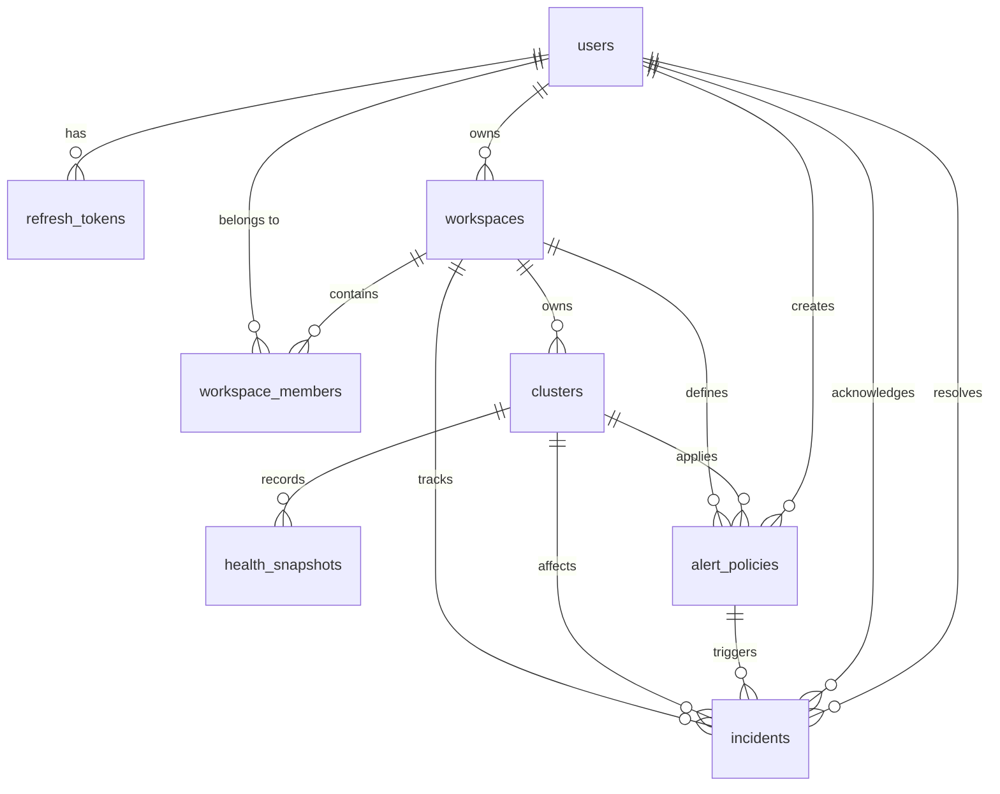
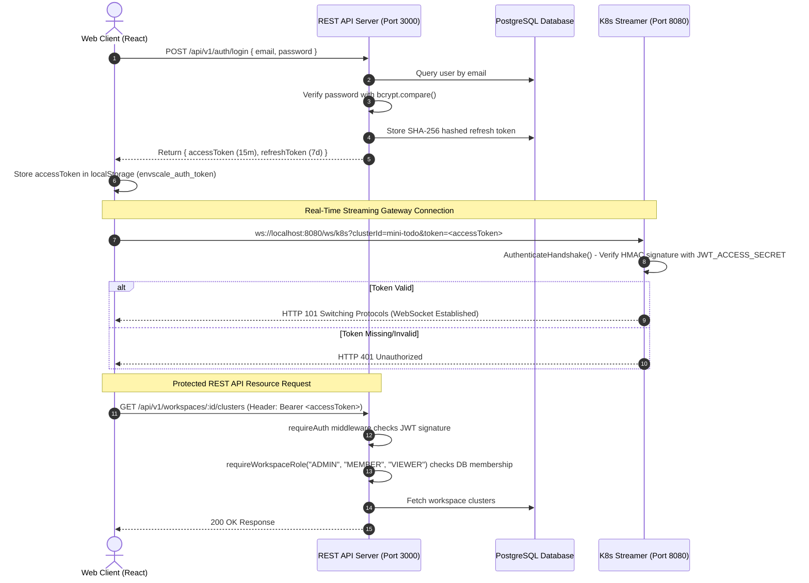

# EnvScale — Database Schema & Authentication Architecture Documentation

> **Target Audience:** Engineering Team & AI Assistant System  
> **Repository:** `EnvScale` Monorepo  
> **Last Updated:** August 28, 2026  
> **Document Status:** Active Technical Reference

---

## Part I: Complete PostgreSQL Database Schema

The database layer is managed using **PostgreSQL** and **Drizzle ORM** (`apps/api-server/src/db/schema`). All primary keys use `UUIDv4` generated via `defaultRandom()`. Cascading foreign keys and optimized B-Tree indexes enforce transactional data integrity and tenant isolation.

---

### 1. `users` Table
Stores user accounts, password hashes, and global role assignments.

* **File:** `apps/api-server/src/db/schema/users.ts`

| Column Name | Data Type | Constraints / Default | Description |
| :--- | :--- | :--- | :--- |
| `id` | `UUID` | Primary Key, `defaultRandom()` | Unique user identifier |
| `email` | `VARCHAR(255)` | `NOT NULL`, `UNIQUE` | User email address |
| `name` | `VARCHAR(255)` | `NOT NULL` | Display name |
| `password_hash` | `TEXT` | `NOT NULL` | `bcrypt` hashed password (cost factor 12) |
| `avatar` | `VARCHAR(500)` | Nullable | Avatar image URL |
| `role` | `VARCHAR(50)` | Default: `'user'` | Global role (`user`, `admin`) |
| `is_active` | `BOOLEAN` | Default: `true` | Account active state |
| `last_login` | `TIMESTAMP` | Nullable | Timestamp of last login |
| `created_at` | `TIMESTAMP` | `NOT NULL`, `defaultNow()` | Account creation time |
| `updated_at` | `TIMESTAMP` | `NOT NULL`, `defaultNow()` | Account update time |

* **Indexes & Constraints:**
  * `users_email_idx` (Unique Index on `email`)
  * `users_active_idx` (B-Tree Index on `is_active`)

---

### 2. `refresh_tokens` Table
Tracks cryptographically hashed refresh tokens for session rotation and remote revocation.

* **File:** `apps/api-server/src/db/schema/users.ts`

| Column Name | Data Type | Constraints / Default | Description |
| :--- | :--- | :--- | :--- |
| `id` | `UUID` | Primary Key, `defaultRandom()` | Token entry ID |
| `user_id` | `UUID` | `NOT NULL`, FK -> `users.id` (CASCADE) | User ownership ID |
| `token_hash` | `TEXT` | `NOT NULL`, `UNIQUE` | SHA-256 hash of refresh token |
| `expires_at` | `TIMESTAMP` | `NOT NULL` | Token expiration date (7 days) |
| `revoked_at` | `TIMESTAMP` | Nullable | Revocation timestamp |
| `created_at` | `TIMESTAMP` | `NOT NULL`, `defaultNow()` | Issue timestamp |

* **Indexes & Constraints:**
  * `refresh_tokens_user_id_idx` (Index on `user_id`)
  * `refresh_tokens_token_hash_idx` (Unique Index on `token_hash`)
  * `refresh_tokens_user_id_fk` (Foreign Key -> `users.id` ON DELETE CASCADE)

---

### 3. `workspaces` Table
Multi-tenant organizational boundary table.

* **File:** `apps/api-server/src/db/schema/workspaces.ts`

| Column Name | Data Type | Constraints / Default | Description |
| :--- | :--- | :--- | :--- |
| `id` | `UUID` | Primary Key, `defaultRandom()` | Workspace ID |
| `name` | `VARCHAR(255)` | `NOT NULL` | Workspace name |
| `slug` | `VARCHAR(255)` | `NOT NULL`, `UNIQUE` | URL-safe slug |
| `description` | `TEXT` | Nullable | Workspace description |
| `owner_id` | `UUID` | `NOT NULL`, FK -> `users.id` (CASCADE) | Owner user ID |
| `logo` | `VARCHAR(500)` | Nullable | Workspace logo URL |
| `metadata` | `JSONB` | Nullable | Custom organization settings |
| `is_active` | `BOOLEAN` | Default: `true` | Active status |
| `created_at` | `TIMESTAMP` | `NOT NULL`, `defaultNow()` | Creation timestamp |
| `updated_at` | `TIMESTAMP` | `NOT NULL`, `defaultNow()` | Modification timestamp |

* **Indexes & Constraints:**
  * `workspaces_owner_id_idx` (Index on `owner_id`)
  * `workspaces_slug_idx` (Unique Index on `slug`)
  * `workspaces_owner_id_fk` (Foreign Key -> `users.id` ON DELETE CASCADE)

---

### 4. `workspace_members` Table
Junction table defining user roles within multi-tenant workspaces.

* **File:** `apps/api-server/src/db/schema/workspaces.ts`

| Column Name | Data Type | Constraints / Default | Description |
| :--- | :--- | :--- | :--- |
| `workspace_id` | `UUID` | `NOT NULL`, FK -> `workspaces.id` (CASCADE) | Parent workspace |
| `user_id` | `UUID` | `NOT NULL`, FK -> `users.id` (CASCADE) | Member user ID |
| `role` | `VARCHAR(50)` | Default: `'MEMBER'` | Role (`ADMIN`, `MEMBER`, `VIEWER`) |
| `joined_at` | `TIMESTAMP` | `NOT NULL`, `defaultNow()` | Membership join time |
| `updated_at` | `TIMESTAMP` | `NOT NULL`, `defaultNow()` | Role update time |

* **Indexes & Constraints:**
  * `workspace_members_pkey` (Composite Primary Key: `[workspace_id, user_id]`)
  * `workspace_members_workspace_id_idx` (Index on `workspace_id`)
  * `workspace_members_user_id_idx` (Index on `user_id`)

---

### 5. `clusters` Table
Registered Kubernetes clusters connected to EnvScale.

* **File:** `apps/api-server/src/db/schema/clusters.ts`

| Column Name | Data Type | Constraints / Default | Description |
| :--- | :--- | :--- | :--- |
| `id` | `UUID` | Primary Key, `defaultRandom()` | Cluster ID |
| `workspace_id` | `UUID` | `NOT NULL`, FK -> `workspaces.id` (CASCADE) | Target workspace ID |
| `name` | `VARCHAR(255)` | `NOT NULL` | Cluster name |
| `type` | `VARCHAR(50)` | `NOT NULL` | Type (`minikube`, `k3s`, `eks`) |
| `kubeconfig` | `TEXT` | Nullable | **AES-256-GCM Encrypted Payload** |
| `api_server_url` | `VARCHAR(500)` | Nullable | K8s API endpoint URL |
| `version` | `VARCHAR(50)` | Nullable | K8s version string |
| `node_count` | `INTEGER` | Default: `0` | Active node count |
| `health_score` | `DECIMAL(5,2)` | Default: `'0.00'` | Cluster Health Index score |
| `status` | `VARCHAR(50)` | Default: `'disconnected'` | (`connected`, `disconnected`, `degraded`) |
| `last_sync_at` | `TIMESTAMP` | Nullable | Last telemetry sync time |
| `metadata` | `JSONB` | Nullable | Additional cluster metadata |
| `created_at` | `TIMESTAMP` | `NOT NULL`, `defaultNow()` | Registration time |
| `updated_at` | `TIMESTAMP` | `NOT NULL`, `defaultNow()` | Last update time |

---

### 6. `health_snapshots` Table
Historical cluster telemetry score log used for gamified leaderboard calculations.

* **File:** `apps/api-server/src/db/schema/clusters.ts`

| Column Name | Data Type | Constraints / Default | Description |
| :--- | :--- | :--- | :--- |
| `id` | `UUID` | Primary Key, `defaultRandom()` | Snapshot ID |
| `cluster_id` | `UUID` | `NOT NULL`, FK -> `clusters.id` (CASCADE) | Cluster ID |
| `health_score` | `DECIMAL(5,2)` | `NOT NULL` | Calculated health score (0-100) |
| `timestamp` | `TIMESTAMP` | `NOT NULL`, `defaultNow()` | Telemetry timestamp |
| `details` | `JSONB` | Nullable | Score metric breakdowns |
| `pod_status` | `JSONB` | Nullable | Pod counts (`running`, `failed`, `pending`) |
| `node_status` | `JSONB` | Nullable | Node health metrics |
| `network_status` | `JSONB` | Nullable | Network packet drop metrics |
| `storage_status` | `JSONB` | Nullable | PVC disk usage metrics |
| `uptime` | `DECIMAL(5,2)` | Nullable | Uptime percentage |
| `created_at` | `TIMESTAMP` | `NOT NULL`, `defaultNow()` | Insertion timestamp |

---

### 7. `alert_policies` Table
Custom cluster monitoring threshold policies.

* **File:** `apps/api-server/src/db/schema/alerts.ts`

| Column Name | Data Type | Constraints / Default | Description |
| :--- | :--- | :--- | :--- |
| `id` | `UUID` | Primary Key, `defaultRandom()` | Alert policy ID |
| `workspace_id` | `UUID` | `NOT NULL`, FK -> `workspaces.id` (CASCADE) | Target workspace ID |
| `cluster_id` | `UUID` | `NOT NULL`, FK -> `clusters.id` (CASCADE) | Target cluster ID |
| `name` | `VARCHAR(255)` | `NOT NULL` | Policy name |
| `description` | `TEXT` | Nullable | Rule description |
| `metric` | `VARCHAR(255)` | `NOT NULL` | Target metric (`pod_restart_count`, `cpu_usage`) |
| `threshold` | `DECIMAL(10,2)` | `NOT NULL` | Trigger numeric threshold |
| `operator` | `VARCHAR(20)` | `NOT NULL` | Comparison operator (`>`, `>=`, `<`, `<=`, `==`) |
| `duration` | `INTEGER` | `NOT NULL` | Evaluation window (seconds) |
| `severity` | `VARCHAR(50)` | Default: `'warning'` | Severity level (`critical`, `warning`, `info`) |
| `is_enabled` | `BOOLEAN` | Default: `true` | Active rule state |
| `conditions` | `JSONB` | Nullable | Additional evaluation conditions |
| `notification_channels` | `JSONB` | Nullable | Alert routing destinations |
| `created_by` | `UUID` | `NOT NULL`, FK -> `users.id` (RESTRICT) | Creator user ID |
| `created_at` | `TIMESTAMP` | `NOT NULL`, `defaultNow()` | Policy creation timestamp |
| `updated_at` | `TIMESTAMP` | `NOT NULL`, `defaultNow()` | Modification timestamp |

---

### 8. `incidents` Table
Triggered cluster alert instances and remediation history log.

* **File:** `apps/api-server/src/db/schema/incidents.ts`

| Column Name | Data Type | Constraints / Default | Description |
| :--- | :--- | :--- | :--- |
| `id` | `UUID` | Primary Key, `defaultRandom()` | Incident ID |
| `workspace_id` | `UUID` | `NOT NULL`, FK -> `workspaces.id` (CASCADE) | Workspace ID |
| `cluster_id` | `UUID` | `NOT NULL`, FK -> `clusters.id` (CASCADE) | Cluster ID |
| `alert_policy_id` | `UUID` | `NOT NULL`, FK -> `alert_policies.id` (CASCADE) | Originating policy ID |
| `title` | `VARCHAR(255)` | `NOT NULL` | Incident title |
| `description` | `TEXT` | Nullable | Issue summary |
| `severity` | `VARCHAR(50)` | `NOT NULL` | (`critical`, `warning`, `info`) |
| `status` | `VARCHAR(50)` | Default: `'open'` | (`open`, `acknowledged`, `resolved`) |
| `value` | `DECIMAL(10,2)` | Nullable | Metric value at trigger time |
| `acknowledged_by` | `UUID` | Nullable, FK -> `users.id` (SET NULL) | Acknowledging user ID |
| `acknowledged_at` | `TIMESTAMP` | Nullable | Acknowledgment timestamp |
| `resolved_by` | `UUID` | Nullable, FK -> `users.id` (SET NULL) | Resolving user ID |
| `resolved_at` | `TIMESTAMP` | Nullable | Resolution timestamp |
| `root_cause` | `TEXT` | Nullable | Identified root cause |
| `resolution` | `TEXT` | Nullable | Applied fix notes |
| `related_events` | `JSONB` | Nullable | Associated K8s event logs |
| `created_at` | `TIMESTAMP` | `NOT NULL`, `defaultNow()` | Incident trigger time |
| `updated_at` | `TIMESTAMP` | `NOT NULL`, `defaultNow()` | Modification time |

---

## Part II: Complete Authentication & Security Architecture

EnvScale uses a multi-layered security architecture comprising REST API authentication, RBAC middleware guards, real-time WebSocket handshake verification, and AES secret encryption.

---

### 1. Password Security
* **Algorithm:** `bcrypt` with cost factor 12.
* **Module:** `apps/api-server/src/services/auth.service.ts`
* **Rules:** Plain text passwords are never stored or logged.

### 2. Dual-Token JWT Lifecycle
* **Access Tokens:**
  * Expiration: **15 minutes**.
  * Payload: `{ sub: user.id, email: user.email, role: user.role }`.
  * Signed using: `JWT_ACCESS_SECRET` via HMAC SHA-256 (`HS256`).
* **Refresh Tokens:**
  * Expiration: **7 days** (168 hours).
  * Storage: Generated via cryptographically secure random bytes (`randomBytes(48)`), hashed with SHA-256, and stored in `refresh_tokens` table.
  * Rotation: Calling `rotateRefreshToken` revokes the previous token (`revokedAt = now()`) and issues a fresh token pair.

### 3. REST API Access Control Middleware
* **`requireAuth` Middleware:**
  * Inspects `Authorization: Bearer <token>` header.
  * Verifies JWT against `JWT_ACCESS_SECRET`.
  * Looks up user in DB (`getUserById`) to confirm `isActive === true`.
  * Attaches user object to `request.user`.
* **`requireWorkspaceRole` Middleware:**
  * Extracts `:id` workspace parameter.
  * Queries `workspaces` and `workspace_members` tables.
  * Verifies if caller is the Workspace Owner (`ADMIN`) or holds an authorized role (`ADMIN`, `MEMBER`, `VIEWER`). Returns `403 Forbidden` on role mismatch.

### 4. WebSocket Gateway Handshake Authentication (`apps/k8s-streamer`)
* **Endpoint:** `ws://localhost:8080/ws/k8s`
* **Handshake Validation:**
  * Checks `?token=` query parameter or `Authorization: Bearer <token>` header.
  * Evaluates signature against `JWT_ACCESS_SECRET`.
  * **Algorithm Confusion Guard:** Explicitly verifies HMAC method `token.Method.(*jwt.SigningMethodHMAC)`.
* **Fail-Closed Boot Guard:**
  * If `NODE_ENV=production` or `ENV=production` and `JWT_ACCESS_SECRET` is missing, gateway executes `log.Fatal()` and halts immediately.
  * In local dev, unauthenticated connections are rejected unless `ALLOW_ANONYMOUS_WS=true` is set.

### 5. Secrets Encryption at Rest (`AES-256-GCM`)
* **Module:** `apps/api-server/src/utils/crypto.ts`
* **Details:** Kubeconfig credentials and cloud tokens are encrypted prior to database insertion using `AES-256-GCM` with dynamic 12-byte initialization vectors (`IV`) and 16-byte authentication tags.
* **Storage Payload Format:** `v1:<base64_iv>:<base64_authTag>:<base64_ciphertext>`

### 6. HTTP & Input Security Controls
* **Helmet Security Headers:** `app.use(helmet({ crossOriginResourcePolicy: { policy: "cross-origin" } }))` protects against MIME-sniffing, clickjacking, and XSS.
* **Zod Input Validation:** REST payload bodies are validated via Zod schemas before hitting controllers.
* **Rate Limiting:** `authLimiter` restricts `/api/v1/auth/login` to 10 attempts per 15 minutes per IP; `standardLimiter` caps general API calls to 100 requests per minute per IP.
